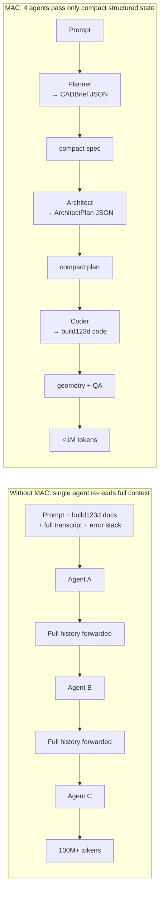
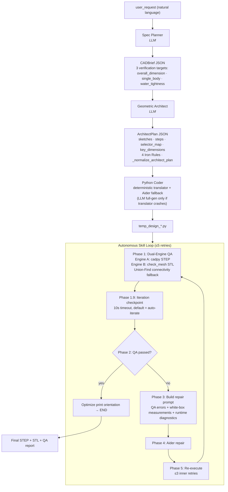

# 🛠️ MAC (Multi-Agent CAD): Generate printable 3D models with 1% the tokens

> Tsinghua University · IEI Lab

```
███╗   ███╗ █████╗  ██████╗
████╗ ████║██╔══██╗██╔════╝
██╔████╔██║███████║██║
██║╚██╔╝██║██╔══██║██║
██║ ╚═╝ ██║██║  ██║╚██████╗
╚═╝     ╚═╝╚═╝  ╚═╝ ╚═════╝
```

> 4 agents collaborating · 116× fewer tokens · 99.3% feature pass rate — turn concise natural language directly into printable 3D models.

[](https://opensource.org/licenses/MIT)
[](https://www.python.org/downloads/)
[](https://github.com/gumyr/build123d)


> **Same CAD generation capability, 1/116 the tokens, 1/13 the inference cost.**

| | [Single-agent baseline](https://github.com/earthtojake/text-to-cad) | MAC | Advantage |
|---|---:|---:|---:|
| Tokens | 103.9M | **896k** | **116× ↓** |
| Cost | ¥125.69 | **¥9.67** | **13× ↓** |
| Pass rate | 97.9% (138/141) | **99.3%** (140/141) | ↑ |

---

## 📖 Table of Contents
- [1. 📸 Real-World Gallery](#1-real-world-gallery)
- [2. 💡 Introduction](#2-introduction)
- [3. ✨ Core Features](#3-core-features)
- [4. 📊 Quantitative Evaluation](#4-quantitative-evaluation)
- [5. 🧠 System Architecture](#5-system-architecture)
- [6. 🚀 Quick Start](#6-quick-start)
- [7. 📝 Citation](#7-citation)

---

## 1. 📸 Real-World Gallery


The 18 samples below were each generated by MAC: 8 showcase samples (practical + decorative + articulable) + 10 benchmark parts (P1–P10, sharing prompts with [earthtojake/text-to-cad](https://github.com/earthtojake/text-to-cad)). Original prompts are in [qwen3.7_token.md](qwen3.7_token.md).

### 🛠️ Practical Samples

#### Hex-Grid Desktop Organizer


Hexagonal body (80 mm flat-to-flat × 40 mm tall) with a honeycomb array of hexagonal pockets milled into the top face, a paperclip cutout on each of the 6 vertical sides, and 1.5 mm fillets on the top perimeter edges. Tests arrayed features and multi-boundary boolean cuts.
*Prompt source: [qwen3.7_token.md](qwen3.7_token.md) test1*

#### Smartphone Stand


100×80×6 mm filleted base + 65° backward-tilted panel + two anti-slip lip blocks + two triangular reinforcement ribs. The panel is built as a YZ parallelogram sketch extruded along X.
*Prompt source: [qwen3.7_token.md](qwen3.7_token.md) test3*

### 🎨 Decorative Samples

#### Concentric Gyroscope Desk Sculpture


Three orthogonal concentric rings (outer / middle / inner) + central sphere + cylindrical base, connected by 4 mm cylindrical pegs. Tests spatial rotation matrices and multi-body boolean connectivity.
*Prompt source: [qwen3.7_token.md](qwen3.7_token.md) test2*

#### Decorative Lighthouse Ornament


Circular base + tapered frustum tower + observation platform + 8 evenly-spaced support brackets + lantern room (with 8 windows) + conical roof + arched doorway entrance + three rows of recessed windows + five protruding decorative bands. Overall height 180 mm, max diameter 70 mm. Tests complex rotational array features and embossed detailing.
*Prompt source: [qwen3.7_token.md](qwen3.7_token.md) test4*

#### Geneva Mechanism Drive Wheel


Solid base cylinder (r=30 mm, h=6 mm) with a central through-hole (r=5 mm), 4 straight slots arrayed at 90°, scalloped outer edges cut by 4 circular arcs (r=12 mm), and 1 mm chamfer on top outer edges. Tests polar-arrayed boolean cuts and arc-based negative geometry.
*Prompt source: [qwen3.7_token.md](qwen3.7_token.md) test8*

### 🤖 Articulable Print-in-Place Models


Multi-body articulable models that print pre-assembled — multiple independent solid bodies coexist in one STEP with 0.4–1 mm clearance gaps so they move freely right off the build plate, no assembly required. This is a harder scenario than single-body generation: not only must the pipeline model each body separately, it must also precisely control clearances so the kinematic pairs actually function.

#### Ball-in-Cage Fidget Toy


40 mm cube cage + internal r=16 mm spherical cavity + 6 circular through-holes (r=12 mm, one per face) for visibility and touch + internal r=15 mm solid ball, with 1 mm clearance between ball and cage everywhere. Tests multi-body parts and clearance control.
*Prompt source: [qwen3.7_token.md](qwen3.7_token.md) test5*

#### Articulable Gyroscope


Outer ring (r=30/23 mm) with 12 outer gear notches + two r=2.4 mm through-holes along X axis; inner ring (r=22/15 mm) with 8 inner gear notches + two r=2.0 mm pivot pins protruding along X into the outer ring holes. The 0.4 mm radius gap lets the inner ring spin freely around X. Tests pivot fits and rotational DOF.
*Prompt source: [qwen3.7_token.md](qwen3.7_token.md) test6*

#### Multi-link Chain


5 identical torus links (major r=10 mm, minor r=2.5 mm) interlocking sequentially, alternating orientation (XY plane ↔ rotated 90° around X), 13 mm apart along X, 0.5 mm clearance between adjacent links so each swings freely. Tests multi-body interlock and alternating array.
*Prompt source: [qwen3.7_token.md](qwen3.7_token.md) test7*

### 📐 Benchmark Parts (P1–P10)

10 mechanical parts covering arrayed features, boolean operations, rotational patterns, helical sweeps, and multi-body assemblies. The benchmark models shown below were all generated by this project using prompts from [earthtojake/text-to-cad](https://github.com/earthtojake/text-to-cad) (CAD skill). Detailed prompts and per-feature pass rates are in [qwen3.7_token.md](qwen3.7_token.md).

| # | Part | Key geometric features |
|---|---|---|
| P1 | Rectangular block with 4 through-holes | 2×2 array, top-edge chamfer |
| P2 | Circular flange | 6-fold rotational symmetry, central bore + bolt-circle holes |
| P3 | L-bracket | Base + back plate + gussets + multi-direction through-holes |
| P4 | Stepped shaft | 3 coaxial sections + keyway + end chamfers |
| P5 | Open-top enclosure | 4 internal standoffs + blind holes + vertical corner fillets |
| P6 | Aerospace clevis bracket | 2 lugs + horizontal hole + lightening cutouts + ribs |
| P7 | Radial-engine cylinder | 12 cooling fins + base flange + angled spark-plug boss |
| P8 | Centrifugal impeller | 12 backward-curved blades + backplate + central hub |
| P9 | Miniature spiral staircase | 20 wedge treads + helical handrail + 20 balusters |
| P10 | Planetary gear assembly | Sun gear + 3 planet gears + ring gear + carrier |

#### Benchmark model views

| P1 | P2 | P3 | P4 | P5 |
|---|---|---|---|---|
|  |  |  |  |  |

| P6 | P7 | P8 | P9 | P10 |
|---|---|---|---|---|
|  |  |  |  |  |

> Design your own prints! See [§6 Quick Start](#6-quick-start) for how to generate a model.

---

## 2. 💡 Introduction

Recent LLM-based text-to-CAD agents can already generate complex models, but their reasoning process is expensive: long-context interaction repeatedly consumes tokens on documentation, conversation history, and debugging traces.

**The bottleneck is not CAD capability, but inefficient reasoning organization.** A single agent on a 10-prompt benchmark burns **103M tokens and 1,307 API calls** for a 97.9% pass rate.

**MAC** splits the generation process into 4 agents wired together by a LangGraph state machine. Agents pass only compact structured states (`CADBrief`, `ArchitectPlan`, QA reports) instead of raw conversation, compressing token usage to 1/116:

| Stage | Agent | Input | Output |
|---|---|---|---|
| 1 | **Spec Planner** | natural-language request | `CADBrief` JSON (only 3 verification targets) |
| 2 | **Geometric Architect** | `CADBrief` | `ArchitectPlan` JSON (sketches, steps, selectors) |
| 3 | **Python Coder** | `ArchitectPlan` | `temp_design.py` (deterministic translator first, Aider fallback) |
| 4 | **Autonomous Skill Loop** | code + STEP/STL | final STEP + Dual-Engine QA report (Aider repair loop) |

Each agent only sees the small, structured snapshot its role requires — there is no shared bloated context. Hallucination propagation is cut off at the stage boundary: even if one agent makes a mistake, the next stage continues from the structured output, not from the previous agent's narrative.

**10-prompt / 141-feature benchmark results (Qwen 3.7-max, CNY):**

| Metric | single-agent baseline | **MAC** | ratio |
|---|---:|---:|---:|
| Total cost | 125.69 | **9.67** | 13× cheaper |
| Total tokens | 103,950,189 | **896,340** | 116× fewer |
| API calls | 1,307 | **50** | 26× fewer |
| Feature pass rate | 97.9% (138/141) | **99.3%** (140/141) | — |

MAC is also a white-box system: every intermediate artifact (`CADBrief`, `ArchitectPlan`, `temp_design.py`, `temp_measurements_*.json`, `temp_missed_*.json`, QA report) is serialized to disk and human-auditable. You can intervene at any iteration checkpoint, override a passing result, and feed additional change requirements directly into the Aider repair prompt.

---

## 3. ✨ Core Features

### Why token efficiency is the core metric?

CAD generation is inherently a multi-round process: code generation → execution → error analysis → repair → regenerate. A naive agent stuffs the full conversation (prompt + build123d docs + error stack) into context on every round, so tokens grow exponentially with iterations — per-run cost can climb from a few cents to a few dollars. MAC passes structured state instead of raw conversation, turning exponential growth linear: same multi-round iteration, 13× lower total cost, 116× fewer total tokens, and a higher 99.3% feature pass rate.

### 🚀 Structured state passing, not context replay — 13× token efficiency
Each agent's input is the previous stage's structured JSON output (`CADBrief`, `ArchitectPlan`), not a re-stuffed transcript. The Spec Planner reads only the user request; the Architect reads only `CADBrief`; the Coder reads only `ArchitectPlan`; Aider reads only the QA error report + `build123d_reference.md`. No agent ever re-reads the full conversation history. On the 10-prompt benchmark this cuts total tokens from **103.9M → 0.90M (116×)** and total cost from **¥125.69 → ¥9.67 (13×)**, while raising the feature pass rate from 97.9% to 99.3%.

### 🔍 White-box transparency — audit or override any stage
Every intermediate artifact is on disk: [pipeline_cache/cad_brief.json](pipeline_cache/cad_brief.json), [pipeline_cache/architect_plan.json](pipeline_cache/architect_plan.json), `temp_design_*.py`, `temp_measurements_*.json` (white-box feature dimensions), `temp_missed_*.json` (runtime diagnostics classified as `MISSED_CUT` / `FILLET_FAILED` / `CHAMFER_FAILED`), QA report. The Autonomous Skill Loop also exposes an **iteration checkpoint** — after each QA pass it prints STEP/STL paths, QA status, and a 10-second window to pick auto-iterate / user-intervention / stop. Intervene mid-loop and your change requirements are prepended verbatim to the Aider repair prompt.

### 🧠 Hybrid routing — per-stage model freedom, more room for customization
A traditional single agent stuffs every task (requirement parsing, geometric design, code generation, error repair) into one model — you're forced to pick one "all-rounder" expensive model. MAC decouples these 4 stages so **each stage can pick its own model** (see the `SPEC_PLANNER_*` / `ARCHITECT_*` / `CODER_*` / `AIDER_*` / `REPAIR_*` blocks in [config.py](multi_agent_cad/config.py), each with independent `MODEL` / `TEMPERATURE` / `MAX_TOKENS` / `KWARGS`, e.g. the thinking-chain toggle):

- **Spec Planner** (requirement parsing) — "read a paragraph, output structured JSON" is simple work; you can hang a cheap lightweight model or a local small model here
- **Geometric Architect** and **Python Coder** — tasks that need spatial imagination and algorithmic reasoning should use a strong model like qwen3.7-max
- **Aider Repair** — swap in Claude/GPT (better at code) or even train a local model specialized in build123d repair

Going further — since stages hand off only via structured JSON (`CADBrief`, `ArchitectPlan`), **any one stage can be replaced with a specialized local model you trained without touching the others**. For example, train a small model that only reads `CADBrief` and outputs `ArchitectPlan`, replacing the Architect stage's qwen call and dropping per-run cost from ~¥0.5 to near zero. This is impossible in a single-agent architecture — the single agent's prompt and context are deeply coupled, you can't swap just one piece.

### 🛡️ Deterministic translator — zero tokens for common CAD ops

LLM-only CAD agents burn tokens every time they generate code. MAC flips this: the deterministic translator [`_plan_to_code`](multi_agent_cad/nodes.py) takes the Coder stage's "read JSON, write code" work entirely off the LLM — it translates `ArchitectPlan` directly into build123d code at **zero token cost**. It supports `extrude`, `revolve`, `hole`, `boolean_union/cut`, `pattern_linear/circular`, `mirror`, `fillet`, `chamfer`, `shell`, and other common CAD operations; only unsupported step types (`draft`, `rib`, custom polygons without `control_points`) emit `# TODO_AIDER` placeholders for Aider to fill.

This is one of the keys to the 1/116 token reduction: common geometric operations go through the translator, and the LLM is only invoked on edge cases. It's also the extreme of §3.4's hybrid routing — the Coder stage's model call drops to zero.

Default config: Qwen 3.7-max with thinking enabled on Planner/Coder/Repair, disabled on Architect for JSON determinism.

---

## 4. 📊 Quantitative Evaluation

Benchmark: 10 prompts (P1–P10), 141 total geometric features. Each feature is a binary pass/fail verified against the generated STEP. Pass rate = features_passed / feature_count. Full methodology, per-prompt breakdown, and failure-mode analysis: [quantified_quality.md](quantified_quality.md) / [quantified_quality Chinese.md](quantified_quality%20Chinese.md). Raw token / API / cost data: [qwen3.7_token.md](qwen3.7_token.md).

The `cad skill` baseline is the [`cad` skill](https://github.com/earthtojake/text-to-cad/tree/main/skills/cad) from [earthtojake/text-to-cad](https://github.com/earthtojake/text-to-cad) (CAD Skills, [docs](https://www.cadskills.xyz)) — a single-agent text-to-CAD generator built on Claude Code skills.

> **Fairness note**: MAC and the `cad skill` baseline use **the same prompt set** (P1–P10, sourced from [that project's benchmarks/](https://github.com/earthtojake/text-to-cad/tree/main/benchmarks)), **the same test set**, and **the same geometric evaluation criteria** (141 features, binary pass/fail). The only variable is the agent architecture.

> **About the baseline 97.9%**: the original `cad skill` only achieves 97.9%. Reason: the original author tested with Claude and ChatGPT, while this round uses the weaker Qwen 3.7-max. Baseline and MAC share the same LLM, with agent architecture as the only variable — MAC hits 99.3%, edge entirely from architecture.

### Headline numbers

| Metric | [cad skill](https://github.com/earthtojake/text-to-cad) (text to cad, Claude Code skill) | **MAC (this pipeline)** | ratio (skill / MAC) |
|---|---:|---:|---:|
| Total cost (CNY) | 125.69 | **9.67** | **13.0×** |
| Total tokens | 103,950,189 | **896,340** | **116.0×** |
| Total input tokens | 5,971,566 | 523,924 | 11.4× |
| Total cache_read tokens | 96,192,896 | 10,496 | 9,165× |
| Total output tokens | 1,785,727 | 361,920 | 4.93× |
| Total API calls | 1,307 | **50** | **26.1×** |
| Features passed / total | 138 / 141 | **140 / 141** | — |
| Feature pass rate | 97.9% | **99.3%** | — |
| Defensive corrections | 0 | 1 | — |

Across 10 prompts / 141 features, MAC hits **99.3% pass rate** at **13× lower cost** and **116× fewer tokens**, while also producing one **defensive correction** — on P9, MAC proactively recognized that the original "tread inner end approaches column" spec would produce point-tangent-only geometry (no solid connection, the model would fracture during 3D printing) and automatically adjusted to a safe overlap based on physical common sense. This is the system going beyond literal execution of the spec and prioritizing physical constraints.

### Token Information Density (output / input ratio)

| | cad skill | MAC | MAC advantage |
|---|---:|---:|---:|
| Average output/input | 0.332 | 0.659 | **1.98×** |

A higher ratio here means the LLM's output compute is focused on actual code generation, not wasted on re-reading historical error stacks, build123d reference docs, and lengthy conversation history. The improvement comes from **denominator reduction** (input minimization), not numerator inflation — consistent with the architectural conclusion in §5 of [quantified_quality.md](quantified_quality.md).

---

## 5. 🧠 System Architecture

### Core idea: information compression, not just multi-agent

A generic multi-agent pipeline just splits tasks across agents, but each agent still re-reads the full conversation history — token savings are limited. MAC's key insight is not "we have 4 agents" but **agents pass only compact structured states** (`CADBrief` has a few dozen fields, `ArchitectPlan` a few hundred) — never the raw conversation:



### MAC pipeline full diagram



### Key design choices

- **Structured handoff, not shared context.** Each agent reads only the previous stage's JSON output. No agent re-reads the full conversation. See [multi_agent_cad/WORKFLOW.md](multi_agent_cad/WORKFLOW.md) §5 for the architectural analysis of why this blocks context-hallucination accumulation.
- **Deterministic translator first.** [_plan_to_code](multi_agent_cad/nodes.py) emits build123d code directly from `ArchitectPlan` for `extrude`, `revolve`, `hole`, `boolean_union/cut`, `pattern_linear/circular`, `mirror`, `fillet`, `chamfer`, `shell`, etc. Unsupported types emit `# TODO_AIDER` — Aider fills only those gaps.
- **Dual-Engine QA.** Engine A ([packages/cadpy](packages/cadpy)) inspects STEP topology; Engine B ([legacy_refs/check_mesh.py](legacy_refs/check_mesh.py)) inspects STL mesh + connectivity. When Engine B times out or crashes, the Union-Find fallback connectivity check (no `networkx` dependency) fires.
- **White-box instrumentation.** `_measure_feature` records exact feature dimensions before boolean merges into `temp_measurements_{iter}.json`. QA doesn't read this data — it's only fed back to Aider in the repair prompt so the LLM can see what the code actually produced, not what it intended.
- **Safe fillet / chamfer.** [_safe_fillet](multi_agent_cad/nodes.py) auto-degrades R → R/2 → R/4 → R/8 and uses a lambda edge-selector to force re-evaluation each call (prevents the stale-edges override bug).
- **Per-stage model config.** [config.py](multi_agent_cad/config.py) exposes `SPEC_PLANNER_*`, `ARCHITECT_*`, `CODER_*`, `AIDER_*`, `REPAIR_*` blocks — each with independent `MODEL`, `TEMPERATURE`, `MAX_TOKENS`, and `KWARGS` (e.g. `{"extra_body": {"enable_thinking": True}}`).
- **Iteration checkpoint.** [_prompt_iteration_choice](multi_agent_cad/nodes.py) prints STEP/STL paths + QA status, then offers auto-iterate / user-intervention / stop with a 10-second timeout. User-supplied change requirements are prepended to the Aider repair prompt.

<details>
<summary><b>State flow (LangGraph <code>GraphState</code>) and routing functions</b> — click to expand</summary>

```python
GraphState = {
    "user_request":             str,            # ground truth
    "cad_brief":                CADBrief,       # Stage 1 output
    "architect_plan":           ArchitectPlan,  # Stage 2 output
    "current_python_code":      str,
    "current_python_code_path": str,
    "current_step_path":        str,
    "current_stl_path":         str,
    "qa_report":                QAReport,
    "error_type":               ErrorType,      # NONE / DIMENSION / TOPOLOGY / FATAL
    "iteration_count":          int,
    "max_iterations":           int,            # 5
    "force_refresh":            bool,
    "workflow_id":              str,            # "original" or "aider"
    "node_history":             list[str],
    "execution_log":            list[str],
}
```

Routing functions: `route_after_planner`, `route_after_architect`, `route_after_coder` (each retries up to `_MAX_SELF_RETRIES=3` then falls through; `route_after_coder` falls through to `autonomous_skill_loop` so Aider can attempt to fix code the deterministic coder couldn't generate correctly).

</details>

---

## 6. 🚀 Quick Start

### Installation

```bash
git clone https://github.com/Pan-Chera/Multi-Agent-CAD
cd text-to-cad-main
conda env create -f environment.yml
conda activate multi_agent_cad
```

> pip users see [requirements.txt](requirements.txt) / [pyproject.toml](pyproject.toml). On Windows, the `trimesh`, `rtree`, and `OCP` C extensions are best installed from conda-forge.

### Configuration

Edit [multi_agent_cad/config.py](multi_agent_cad/config.py):

| Field | Purpose |
|---|---|
| `DS_API_KEY` | API key (or set `DASHSCOPE_API_KEY` env var — takes priority over the in-file value) |
| `USER_REQUEST` | Default CAD generation request |
| `DS_BASE_URL` + 4 stages' `MODEL` / `TEMPERATURE` / `MAX_TOKENS` / `KWARGS` | Provider and per-stage model params (see [§3 Hybrid Routing](#-hybrid-routing--per-stage-model-freedom-more-room-for-customization)) |

To restore defaults after editing config:

```bash
python -m multi_agent_cad._config_defaults --reset
```

### Run

```bash
python -m multi_agent_cad.graph          # original workflow: deterministic coder first, Aider fallback
python -m multi_agent_cad.graph_aider    # modify-existing-file workflow: apply USER_REQUEST as modification requirements to an existing temp_design*.py
```

Both entry points stream LangGraph events to the terminal. Each QA pass opens a 10-second checkpoint (auto-iterates on timeout): press `1` auto-iterate, `2` inject change requirements, `3` halt and keep current artifacts.

Output files (written to the repo root):

| File | Contents |
|---|---|
| `temp_output_0.step` / `.stl` | Final model |
| `temp_design_0.py` | Generated build123d source |
| `temp_measurements_0.json` | White-box feature measurements |
| `temp_missed_0.json` | Runtime diagnostics |

For more complex example prompts see [§1 Gallery](#1-real-world-gallery).

### Cache mechanism

`pipeline_cache/` stores the output of the first two stages, saving time and money on re-runs:

| File | Source | Purpose |
|---|---|---|
| `cad_brief.json` | Spec Planner (stage 1) | Parsed requirement as structured data |
| `architect_plan.json` | Geometric Architect (stage 2) | Geometric plan (sketches, steps, selectors) |

**Re-run the same prompt**: just `python -m multi_agent_cad.graph` — the cache is hit, the first two LLM stages are skipped, and the pipeline restarts at the Python Coder stage with a fresh repair loop. Useful when the previous run's QA failed or Aider's repair drifted — same plan, new attempt, seconds not minutes.

**Generate a different model**: the cache checks file existence only, not whether `USER_REQUEST` matches. So if you change the prompt but leave the cache in place, you'll get the old model again. Clear it before generating something new:

```bash
rm pipeline_cache/cad_brief.json pipeline_cache/architect_plan.json
```

Or bypass via code: set `force_refresh: True` in `get_default_initial_state` in [multi_agent_cad/graph.py](multi_agent_cad/graph.py).

### Customizing the prompt

Edit `USER_REQUEST` in [multi_agent_cad/config.py](multi_agent_cad/config.py), e.g.:

```python
USER_REQUEST = "Create a single solid circular flange as a STEP model in millimeters. The flange is a cylinder with an outside diameter of 80 mm and a thickness of 10 mm. Add a central vertical through-bore with diameter 30 mm."
```

Then clear the cache per [Cache mechanism](#cache-mechanism) above and re-run `python -m multi_agent_cad.graph`.

---

## 7. 📝 Citation

If you find this project useful for your research, please consider citing:

```bibtex
@misc{mac2026,
  author = {PUMA and Maurezou},
  title  = {MAC (Multi-Agent CAD): A Decoupled Multi-Agent Framework for Text-to-CAD Generation},
  year   = {2026},
  publisher = {GitHub},
  journal   = {GitHub repository},
  howpublished = {\url{https://github.com/Pan-Chera/Multi-Agent-CAD}}
}
```

The quantitative evaluation in this README uses [earthtojake/text-to-cad](https://github.com/earthtojake/text-to-cad) (CAD Skills) as the comparison baseline. If your paper cites MAC, please also cite that project:

```bibtex
@misc{texttocad2026,
  author = {earthtojake},
  title  = {CAD Skills: A skills library for CAD, robotics, and hardware design agents},
  year   = {2026},
  publisher = {GitHub},
  journal   = {GitHub repository},
  howpublished = {\url{https://github.com/earthtojake/text-to-cad}}
}
```

---

## 📄 License

MIT — see [LICENSE](LICENSE).

## 🙏 Acknowledgements

- [Tsinghua University, IEI Lab](https://www.tsinghua.edu.cn) — the lab where this project was developed; provided the research environment and advisor guidance
- [earthtojake/text-to-cad](https://github.com/earthtojake/text-to-cad) (CAD Skills) — source of the `cad skill` baseline used in the quantitative evaluation; the 10 benchmark prompts (P1–P10) are taken from the project's [benchmarks/](https://github.com/earthtojake/text-to-cad/tree/main/benchmarks) directory
- [build123d](https://github.com/gumyr/build123d) — algebraic B-rep CAD kernel
- [LangGraph](https://langchain-ai.github.io/langgraph/) — stateful agent orchestration
- [Aider](https://aider.chat/) — LLM-driven code repair
- [Qwen 3.7-max](https://www.alibabacloud.com/help/en/model-studio/) — DashScope LLM
