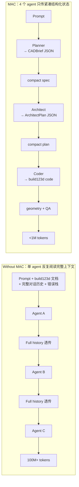
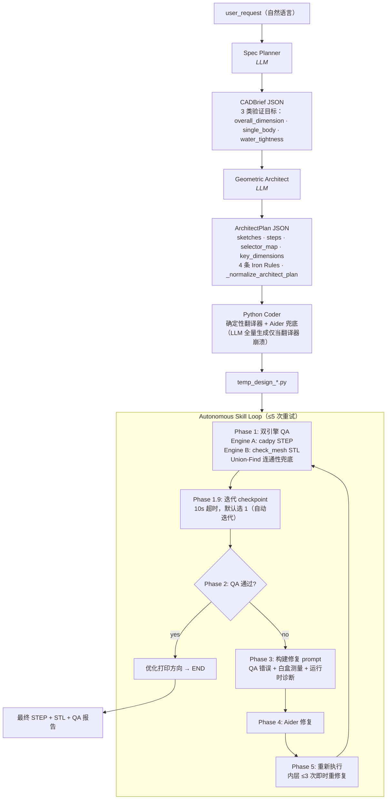

# 🛠️ MAC（Multi-Agent CAD）：用 1% 的 token 生成可打印的 3D 模型

> Tsinghua University · IEI Lab

```
███╗   ███╗ █████╗  ██████╗
████╗ ████║██╔══██╗██╔════╝
██╔████╔██║███████║██║
██║╚██╔╝██║██╔══██║██║
██║ ╚═╝ ██║██║  ██║╚██████╗
╚═╝     ╚═╝╚═╝  ╚═╝ ╚═════╝
```

> 4 个 agent 协作 · token 砍 116× · 特征通过率 99.3% —— 把简洁的自然语言直接变成可打印的 3D 模型。

[](https://opensource.org/licenses/MIT)
[](https://www.python.org/downloads/)
[](https://github.com/gumyr/build123d)


> **同等的 CAD 生成能力，1/116 的 token、1/13 的推理成本。**

| | [CAD Skills](https://github.com/earthtojake/text-to-cad) | MAC (ours) | 优势 |
|---|---:|---:|---:|
| Tokens | 103.9M | **896k** | **116× ↓** |
| Cost | ¥125.69 | **¥9.67** | **13× ↓** |
| Pass rate | 97.9% (138/141) | **99.3%** (140/141) | ↑ |

---

## 📖 目录
- [1. 📸 实物打印画廊](#1-实物打印画廊)
- [2. 🚀 快速上手](#2-快速上手)
- [3. 💡 项目简介](#3-项目简介)
- [4. ✨ 核心优势](#4-核心优势)
- [5. 📊 量化评测](#5-量化评测)
- [6. 🧠 系统架构](#6-系统架构)
- [7. 📝 学术引用](#7-学术引用)

---

## 1. 📸 实物打印画廊


下方 10 个基准测试零件（P1–P10，与 [earthtojake/text-to-cad](https://github.com/earthtojake/text-to-cad) 同源 prompt）与 1 个可动演示均由 MAC 流水线生成。上图实物打印模型的 3D 旋转视图与 prompt 见 [qwen3.7_token.md](qwen3.7_token.md)。

### 🤖 可动样例（print-in-place articulable）


打印即装配的多体可动模型 —— 多个独立实体在同一个 STEP 内通过 0.4–1 mm 微小间隙实现"印完即可动"，无需后续组装。这是单 agent 单实体生成之外更难的场景：不仅要分别建模多个 body，还要精确控制 clearance 让运动副功能化。

### 📐 基准测试零件（P1–P10）

10 个机械零件涵盖阵列特征、布尔运算、旋转阵列、螺旋扫掠、多体装配等典型 CAD 操作。下方演示模型均由本项目根据 [earthtojake/text-to-cad](https://github.com/earthtojake/text-to-cad)（CAD skill）提供的 prompt 生成。详细 prompt 与每条几何特征通过率见 [qwen3.7_token.md](qwen3.7_token.md)。

| # | 零件 | 主要几何特征 |
|---|---|---|
| P1 | 矩形块带 4 通孔 | 2×2 阵列、顶面倒角 |
| P2 | 圆形法兰 | 6 重旋转对称、内孔 + 螺栓孔 |
| P3 | L 形支架 | 底板 + 背板 + 加强筋 + 多方向通孔 |
| P4 | 阶梯轴 | 三段同轴圆柱 + 键槽 + 端面倒角 |
| P5 | 顶部开放外壳 | 4 内部支柱 + 盲孔 + 垂直角圆角 |
| P6 | 航空 U 形支架 | 双耳 + 横孔 + 减重切口 + 加强筋 |
| P7 | 径向发动机气缸 | 12 冷却翅片 + 法兰 + 倾斜火花塞凸台 |
| P8 | 离心叶轮 | 12 后弯叶片 + 背板 + 中心轮毂 |
| P9 | 微型螺旋楼梯 | 20 楔形踏步 + 螺旋扶手 + 20 栏杆 |
| P10 | 行星齿轮组件 | 太阳齿 + 3 行星齿 + 内齿圈 + 行星架 |

#### Benchmark 模型视图

| P1 | P2 | P3 | P4 | P5 |
|---|---|---|---|---|
|  |  |  |  |  |

| P6 | P7 | P8 | P9 | P10 |
|---|---|---|---|---|
|  |  |  |  |  |

> 设计你自己的打印品！参见 [§2 快速上手](#2-快速上手) 了解如何生成模型。

---

## 2. 🚀 快速上手

### 安装

```bash
git clone https://github.com/Pan-Chera/Multi-Agent-CAD
cd text-to-cad-main
conda env create -f environment.yml
conda activate multi_agent_cad
```

> pip 用户见 [requirements.txt](requirements.txt) / [pyproject.toml](pyproject.toml)。Windows 上 `trimesh`、`rtree`、`OCP` 的 C 扩展建议从 conda-forge 装。

### 配置

编辑 [multi_agent_cad/config.py](multi_agent_cad/config.py)：

| 字段 | 作用 |
|---|---|
| `DS_API_KEY` | API key（或设环境变量 `DASHSCOPE_API_KEY`，优先级更高） |
| `USER_REQUEST` | 默认 CAD 生成需求 |
| `DS_BASE_URL` + 4 个阶段的 `MODEL` / `TEMPERATURE` / `MAX_TOKENS` / `KWARGS` | provider 与每阶段模型参数（见 [§4 混合路由](#-混合路由--每阶段独立选模调用更自由二次开发空间更大)） |

配置改坏时一键恢复默认：

```bash
python -m multi_agent_cad._config_defaults --reset
```

### 运行

```bash
python -m multi_agent_cad.graph          # 原始工作流：确定性 coder 优先，Aider 兜底
python -m multi_agent_cad.graph_aider    # 修改工作流：在已有 temp_design*.py 上应用 USER_REQUEST 的修改需求
```

两个入口都会流式打印 LangGraph 事件，每次 QA 后给 10 秒选择（超时自动迭代）：按 `1` 自动迭代、`2` 注入修改需求、`3` 停止并保留当前产物。

跑完后根目录生成：

| 文件 | 内容 |
|---|---|
| `temp_output_0.step` / `.stl` | 最终模型 |
| `temp_design_0.py` | 生成的 build123d 源码 |
| `temp_measurements_0.json` | 白盒特征测量 |
| `temp_missed_0.json` | 运行时诊断 |

更复杂示例 prompt 见 [§1 画廊](#1-实物打印画廊)。

### 缓存机制

`pipeline_cache/` 存储前两个阶段的产出，让重跑省时省钱：

| 文件 | 来源 | 作用 |
|---|---|---|
| `cad_brief.json` | Spec Planner（阶段 1） | 解析后的需求结构化数据 |
| `architect_plan.json` | Geometric Architect（阶段 2） | 几何方案（草图、步骤、选择器） |

**重跑同一 prompt**：直接 `python -m multi_agent_cad.graph` —— 命中缓存跳过前两个 LLM 阶段，从 Python Coder 开始重新生成代码并跑修复循环。如果上次 QA 失败 / Aider 修复跑偏，重跑就能用相同的 plan 再试一次，几秒内出结果。

**生成不同模型**：cache 只检查文件是否存在、不比对 `USER_REQUEST` 内容。所以改了 prompt 不删 cache，会继续用旧 plan 生成旧模型。换模型前必须清缓存：

```bash
rm pipeline_cache/cad_brief.json pipeline_cache/architect_plan.json
```

或代码层面绕过：在 [multi_agent_cad/graph.py](multi_agent_cad/graph.py) 的 `get_default_initial_state` 中设 `force_refresh: True`。

### 自定义 prompt

编辑 [multi_agent_cad/config.py](multi_agent_cad/config.py) 的 `USER_REQUEST`，例如：

```python
USER_REQUEST = "Create a single solid circular flange as a STEP model in millimeters. The flange is a cylinder with an outside diameter of 80 mm and a thickness of 10 mm. Add a central vertical through-bore with diameter 30 mm."
```

改完后按上面 [缓存机制](#缓存机制) 的说明清缓存，再 `python -m multi_agent_cad.graph`。

---

## 3. 💡 项目简介

近期基于 LLM 的 text-to-CAD agent 已能生成复杂模型，但推理成本高昂：长上下文交互反复消费文档、对话历史和调试栈。

**瓶颈不是 CAD 能力，而是低效的推理组织。** 单 agent 跑 10 prompt 基准测试消耗 **103M tokens、1,307 次 API 调用**，仅换来 97.9% 通过率。

**MAC** 把生成过程拆成 4 个 agent，由 LangGraph 状态机串联。agent 之间只传紧凑结构化状态（`CADBrief`、`ArchitectPlan`、QA 报告），不传对话原文，把 token 用量压到 1/116：

| 阶段 | Agent | 输入 | 输出 |
|---|---|---|---|
| 1 | **Spec Planner** | 自然语言需求 | `CADBrief` JSON（仅 3 类验证目标） |
| 2 | **Geometric Architect** | `CADBrief` | `ArchitectPlan` JSON（草图、步骤、选择器） |
| 3 | **Python Coder** | `ArchitectPlan` | `temp_design.py`（确定性翻译器优先，Aider 兜底） |
| 4 | **Autonomous Skill Loop** | 代码 + STEP/STL | 最终 STEP + 双引擎 QA 报告（Aider 修复循环） |

每个 agent 只看自己职责所需的小型、结构化快照 —— 没有共享的臃肿上下文。幻觉传播在阶段边界处被切断：即使一个 agent 出错，下一阶段也只会从结构化输出继续工作，而不会承接上一个 agent 的叙事文本。

**10 个 prompt / 141 个特征的基准测试结果（Qwen 3.7-max，CNY）：**

| 指标 | 单 agent 基线 | **MAC** | 比率 |
|---|---:|---:|---:|
| 总成本 | 125.69 | **9.67** | 便宜 13× |
| 总 token 数 | 103,950,189 | **896,340** | 少 116× |
| API 调用次数 | 1,307 | **50** | 少 26× |
| 特征通过率 | 97.9% (138/141) | **99.3%** (140/141) | — |

MAC 同时是一个白盒系统：每个中间产物（`CADBrief`、`ArchitectPlan`、`temp_design.py`、`temp_measurements_*.json`、`temp_missed_*.json`、QA 报告）都序列化到磁盘，可供人工审计。你可以在每次迭代的 checkpoint 处介入，覆盖通过的结果，并直接把额外的修改需求喂给 Aider 修复 prompt。

---

## 4. ✨ 核心优势

### 为什么 token 效率是核心指标？

CAD 生成天生是多轮迭代过程：代码生成 → 执行 → 错误分析 → 修复 → 再生成。Naive agent 在每一轮都把完整对话历史（prompt + build123d 文档 + 错误栈）重新塞进上下文，token 随迭代轮数指数膨胀，单次推理成本可能从几分钱涨到几块钱。MAC 通过传递结构化状态而非原始对话，把 token 增长压成线性 —— 同样的多轮迭代，总成本下降 13×，总 token 下降 116×，特征通过率反而提升到 99.3%。

### 🚀 结构化状态传递，而非上下文反复阅读 —— 13× token 效率
每个 agent 的输入是上一阶段的结构化 JSON 产出（`CADBrief`、`ArchitectPlan`），不是重新塞满的对话历史。Spec Planner 只读用户需求；Architect 只读 `CADBrief`；Coder 只读 `ArchitectPlan`；Aider 只读 QA 错误报告 + `build123d_reference.md`。没有任何 agent 需要反复阅读完整对话历史。在 10 个 prompt 基准测试中，这把总 token 数从 **103.9M → 0.90M（116×）**、总成本从 **¥125.69 → ¥9.67（13×）** 降下来，同时把特征通过率从 97.9% 提升到 99.3%。

### 🔍 白盒透明度 —— 任意阶段可审计或修改
每个中间产物都在磁盘上：[pipeline_cache/cad_brief.json](pipeline_cache/cad_brief.json)、[pipeline_cache/architect_plan.json](pipeline_cache/architect_plan.json)、`temp_design_*.py`、`temp_measurements_*.json`（白盒特征尺寸）、`temp_missed_*.json`（运行时诊断，分类为 `MISSED_CUT` / `FILLET_FAILED` / `CHAMFER_FAILED`）、QA 报告。Autonomous Skill Loop 还暴露了一个**迭代 checkpoint** —— 每次 QA 完成后打印 STEP/STL 路径、QA 状态，并提供 10 秒窗口让用户选择自动迭代 / 用户介入 / 停止。中途介入时，你的修改需求会原样前置到 Aider 修复 prompt。

### 🧠 混合路由 —— 每阶段独立选模，调用更自由，二次开发空间更大
传统单 agent 把所有任务（需求解析、几何设计、代码生成、错误修复）压在一个模型上，只能选一个"全能型"昂贵模型。MAC 把这 4 个阶段解耦，**每个阶段可以独立选择模型**（见 [config.py](multi_agent_cad/config.py) 的 `SPEC_PLANNER_*` / `ARCHITECT_*` / `CODER_*` / `AIDER_*` / `REPAIR_*` 块，每块都有独立的 `MODEL` / `TEMPERATURE` / `MAX_TOKENS` / `KWARGS`，如思维链开关）：

- **Spec Planner**（需求解析）这种"读一段文字、产出结构化 JSON"的简单工作，可以挂便宜的轻量模型或本地小模型
- **Geometric Architect**（几何设计）和 **Python Coder**（代码生成）这种需要空间想象和算法推理的复杂工作，才挂 qwen3.7-max 这类强模型
- **Aider Repair**（错误修复）可以换 Claude/GPT 这类擅长代码的模型，甚至自训一个专攻 build123d 修复的本地模型

更进一步 —— 由于阶段间只通过结构化 JSON 交接（`CADBrief`、`ArchitectPlan`），**任何一个阶段都可以被替换为你自训的专攻模型，而不影响其他阶段**。例如训一个只读 `CADBrief` 输出 `ArchitectPlan` 的小模型替代 Architect 阶段的 qwen 调用，单次成本从 ~¥0.5 降到接近零。这在单 agent 架构下做不到 —— 单 agent 的 prompt 和上下文深度耦合，无法只替换其中一环。

### 🛡️ 确定性翻译器 —— 常见 CAD 操作零 token

LLM-only CAD agent 每次生成代码都要烧 token。MAC 反其道而行：用确定性翻译器 [`_plan_to_code`](multi_agent_cad/nodes.py) 把 Coder 阶段的"读 JSON 写代码"工作完全脱离 LLM —— 直接从 `ArchitectPlan` 翻译成 build123d 代码，**零 token 成本**。支持 `extrude`、`revolve`、`hole`、`boolean_union/cut`、`pattern_linear/circular`、`mirror`、`fillet`、`chamfer`、`shell` 等常见 CAD 操作；只有不支持的步骤类型（`draft`、`rib`、无 `control_points` 的自定义多边形）才生成 `# TODO_AIDER` 占位符由 Aider 填充。

这是 token 用量降到 1/116 的关键之一：常见几何操作走翻译器，只在边界情况调用 LLM。这也是 §4.4 混合路由的极致——把 Coder 阶段的模型调用降到零。

默认配置：Qwen 3.7-max，Planner/Coder/Repair 开启 thinking，Architect 关闭 thinking 以保证 JSON 确定性。

---

## 5. 📊 量化评测

基准测试：10 个 prompt（P1–P10），共 141 个几何特征。每个特征为二元通过/失败项，对照生成的 STEP 验证。通过率 = 通过特征数 / 特征总数。完整方法论、每 prompt 明细及失败模式分解见 [quantified_quality.md](quantified_quality.md) / [quantified_quality Chinese.md](quantified_quality%20Chinese.md)。原始 token / API / 成本数据见 [qwen3.7_token.md](qwen3.7_token.md)。

对比基线 `cad skill` 即 [earthtojake/text-to-cad](https://github.com/earthtojake/text-to-cad)（CAD Skills，[文档](https://www.cadskills.xyz)）项目的 [`cad` skill](https://github.com/earthtojake/text-to-cad/tree/main/skills/cad) —— 一个基于 Claude Code skill 的单体 agent 文本到 CAD 生成器。

> **公平性说明**：MAC 与基线 `cad skill` 使用**相同 prompt 集**（P1–P10，取自 [该项目 benchmarks/](https://github.com/earthtojake/text-to-cad/tree/main/benchmarks)）、**相同测试集**、**相同几何评估标准**（141 特征二元通过/失败），唯一变量是 agent 架构。

> **关于基线 97.9%**：原 `cad skill` 通过率只有 97.9%。原因：原作者测试时用 Claude 与 ChatGPT，本测试用的是更弱的 Qwen 3.7-max。基线与 MAC 同一 LLM、唯一变量是 agent 架构 —— MAC 跑出 99.3%，优势完全来自架构。

### 核心数据

| 指标 | [cad skill](https://github.com/earthtojake/text-to-cad)（text to cad，Claude Code skill） | **MAC（本流水线）** | 比率（skill / MAC） |
|---|---:|---:|---:|
| 总成本（CNY） | 125.69 | **9.67** | **13.0×** |
| 总 token 数 | 103,950,189 | **896,340** | **116.0×** |
| 总输入 token | 5,971,566 | 523,924 | 11.4× |
| 总 cache_read token | 96,192,896 | 10,496 | 9,165× |
| 总输出 token | 1,785,727 | 361,920 | 4.93× |
| 总 API 调用次数 | 1,307 | **50** | **26.1×** |
| 通过特征 / 总特征 | 138 / 141 | **140 / 141** | — |
| 特征通过率 | 97.9% | **99.3%** | — |
| 防御性修正数 | 0 | 1 | — |

MAC 在 10 个 prompt、141 个特征上达到 **99.3% 通过率**，**13× 成本优势**和 **116× token 优势**的同时还产生了一次**防御性修正** —— P9 中 MAC 主动识别出原需求会导致踏步与立柱无实体连接，3D 打印会断裂，基于物理常识自动调整为安全重叠，避免了模型失效。这是系统超越字面执行、优先满足物理条件的典型表现。

### token 信息密度（output / input 比率）

| | cad skill | MAC | MAC 优势 |
|---|---:|---:|---:|
| 平均 output/input | 0.332 | 0.659 | **1.98×** |

这里比率更高意味着 LLM 的输出算力聚焦在实际代码生成上，而非浪费在反复阅读历史错误栈、build123d 参考文档和冗长对话历史上。该比率的提升来自**分母的精简**（输入极小化），而非分子膨胀 —— 与 [quantified_quality.md](quantified_quality.md) §5 的架构结论一致。

---

## 6. 🧠 系统架构

### 核心思路：信息压缩，而非单纯多 agent

普通 multi-agent 流水线只是把任务拆给多个 agent，但每个 agent 仍然反复阅读完整对话历史 —— token 节省有限。MAC 的关键不是"有 4 个 agent"，而是 **agent 之间只传递紧凑的结构化状态**（`CADBrief` 几十字段、`ArchitectPlan` 几百字段），不传任何对话原文：



### MAC 流水线全图



### 关键设计选择

- **结构化交接，不共享上下文。** 每个 agent 只读上一阶段的 JSON 输出。没有任何 agent 反复阅读完整对话。架构差异如何阻断上下文幻觉累积的分析详见 [multi_agent_cad/WORKFLOW.md](multi_agent_cad/WORKFLOW.md) §5。
- **确定性翻译器优先。** [_plan_to_code](multi_agent_cad/nodes.py) 直接从 `ArchitectPlan` 生成 build123d 代码，支持 `extrude`、`revolve`、`hole`、`boolean_union/cut`、`pattern_linear/circular`、`mirror`、`fillet`、`chamfer`、`shell` 等。不支持的类型生成 `# TODO_AIDER` —— Aider 只填充这些空缺。
- **双引擎 QA。** Engine A（[packages/cadpy](packages/cadpy)）检查 STEP 拓扑；Engine B（[legacy_refs/check_mesh.py](legacy_refs/check_mesh.py)）检查 STL 网格 + 连通性。当 Engine B 超时或崩溃时，Union-Find 兜底连通性检查（不依赖 `networkx`）启动。
- **白盒插桩。** `_measure_feature` 在布尔合并前记录每个特征的精确尺寸到 `temp_measurements_{iter}.json`。QA 不读这些数据 —— 仅在修复 prompt 中喂给 Aider，让 LLM 看到代码实际产出了什么，而不是它原本想产出的。
- **安全圆角/倒角。** [_safe_fillet](multi_agent_cad/nodes.py) 自动降级 R → R/2 → R/4 → R/8，并用 lambda 边选择器强制每次调用重新求值（防止 stale-edges 覆盖 bug）。
- **每阶段独立模型配置。** [config.py](multi_agent_cad/config.py) 暴露 `SPEC_PLANNER_*`、`ARCHITECT_*`、`CODER_*`、`AIDER_*`、`REPAIR_*` 块 —— 每块都有独立的 `MODEL`、`TEMPERATURE`、`MAX_TOKENS` 和 `KWARGS`（如 `{"extra_body": {"enable_thinking": True}}`）。
- **迭代 checkpoint。** [_prompt_iteration_choice](multi_agent_cad/nodes.py) 打印 STEP/STL 路径 + QA 状态，然后提供自动迭代 / 用户介入 / 停止三个选项，10 秒超时。用户输入的修改需求会前置到 Aider 修复 prompt。

<details>
<summary><b>状态流（LangGraph <code>GraphState</code>）与路由函数</b> —— 点击展开</summary>

```python
GraphState = {
    "user_request":             str,            # ground truth
    "cad_brief":                CADBrief,       # 阶段 1 输出
    "architect_plan":           ArchitectPlan,  # 阶段 2 输出
    "current_python_code":      str,
    "current_python_code_path": str,
    "current_step_path":        str,
    "current_stl_path":         str,
    "qa_report":                QAReport,
    "error_type":               ErrorType,      # NONE / DIMENSION / TOPOLOGY / FATAL
    "iteration_count":          int,
    "max_iterations":           int,            # 5
    "force_refresh":            bool,
    "workflow_id":              str,            # "original" 或 "aider"
    "node_history":             list[str],
    "execution_log":            list[str],
}
```

路由函数：`route_after_planner`、`route_after_architect`、`route_after_coder`（每个最多重试 `_MAX_SELF_RETRIES=3` 次后放行；`route_after_coder` 放行到 `autonomous_skill_loop`，让 Aider 有机会修复确定性 coder 生成不出来的代码）。

</details>

---

## 7. 📝 学术引用

如果你觉得本项目对你的研究有帮助，请考虑引用：

```bibtex
@misc{mac2026,
  author = {Guanxing Qu and Xueyan Zou},
  title  = {MAC (Multi-Agent CAD): A Decoupled Multi-Agent Framework for Text-to-CAD Generation},
  year   = {2026},
  publisher = {GitHub},
  journal   = {GitHub repository},
  howpublished = {\url{https://github.com/Pan-Chera/Multi-Agent-CAD}}
}
```

本项目的量化评测以 [earthtojake/text-to-cad](https://github.com/earthtojake/text-to-cad)（CAD Skills）为对比基线。如果您的论文引用了 MAC，建议同时引用该项目：

```bibtex
@misc{texttocad2026,
  author = {earthtojake},
  title  = {CAD Skills: A skills library for CAD, robotics, and hardware design agents},
  year   = {2026},
  publisher = {GitHub},
  journal   = {GitHub repository},
  howpublished = {\url{https://github.com/earthtojake/text-to-cad}}
}
```

---

## 📄 许可证

MIT —— 见 [LICENSE](LICENSE)。

## 🙏 致谢

- [Tsinghua University, IEI Lab](https://maureenzou.github.io/lab.html) —— 本项目所属实验室，提供研究环境与导师指导
- [earthtojake/text-to-cad](https://github.com/earthtojake/text-to-cad)（CAD Skills）—— 对比基线 `cad skill` 的来源；本项目的 10 个 benchmark prompt（P1–P10）取自该项目 [benchmarks/](https://github.com/earthtojake/text-to-cad/tree/main/benchmarks) 目录
- [build123d](https://github.com/gumyr/build123d) —— 代数 B-rep CAD 内核
- [LangGraph](https://langchain-ai.github.io/langgraph/) —— 有状态 agent 编排
- [Aider](https://aider.chat/) —— LLM 驱动的代码修复
- [Qwen 3.7-max](https://www.alibabacloud.com/help/en/model-studio/) —— DashScope LLM
