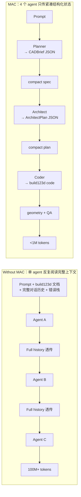

# MAC 宣传文案

> 目标：提升 GitHub 星标。同一组素材，两种平台重组。
>
> 复制时只需复制对应小节内的文本，按图片清单准备配图即可。

---

## 一、小红书版

### 封面图

`assets/overview.jpg` —— 10 个基准零件 + 可动样例实物打印总览，视觉冲击力最强的一张。

### 标题候选（选一个）

1. 1% 的 token 也能生成可打印 3D 模型，清华开源了
2. 一句话生成 3D 模型，成本砍 13×：清华开源
3. text-to-CAD 的 token 砍掉 116×：清华开源框架 MAC
4. text-to-CAD：从 1 亿 token 到 90 万 token
5. text-to-CAD 不再是 token 黑洞：清华开源 MAC 框架

> 推荐用 1 或 2 —— 把"1%"和"清华开源"两个关键词顶到标题。

### 正文（直接复制）

清华 IEI 实验室在原 text-to-cad 的基础上，开源了一个叫 MAC（Multi-Agent CAD）的项目——把"自然语言生成可打印 3D 模型"这件事做到了 **1/116 的 token、1/13 的成本、99.3% 的特征通过率**。

【背景：原 text-to-cad 已经很强】
earthtojake 的 text-to-cad（github 搜 earthtojake/text-to-cad）是基于 Claude Code skill 的单 agent CAD 生成器，已经在 141 个特征测试里跑出 97.9% 的通过率——在 LLM-driven CAD 生成领域里是非常扎实的结果，社区里也有不少曝光，应该很多人都刷到过。MAC 用的 10 个基准 prompt 也都来自原项目。

【但它的痛点是 token】
单 agent 每轮迭代都把完整对话历史 + build123d 文档 + 错误栈全塞回 LLM 上下文，token 随迭代轮数指数膨胀。10 个零件就烧掉 1 亿 token、1,307 次 API 调用、¥125.69 成本。

【MAC 怎么做的】
拆成 4 个 LangGraph agent，agent 之间只传紧凑的结构化 JSON（CADBrief、ArchitectPlan），不传对话原文。同样的 prompt、同样的 Qwen 3.7-max，token 直接砍 116×，通过率反而升到 99.3%。

【成果】
- 10 个机械零件基准测试，全部一次生成 + 实物打印成功
- 还有更难的"印完即可动"模型——陀螺仪、链环、笼中小球，零组装

【其它特性】
- 任意 LLM provider 接入：Qwen / GPT / DeepSeek / Gemini / Claude / 本地 Ollama，改两个 config 字段就切换
- 浏览器 UI 直接预览 3D 模型，Aider 修复循环跑的时候实时刷新中间结果
- 6 小时自动清理临时文件
- 完整白盒：每个中间产物都落盘可审计
- MIT 协议，完整开源

GitHub 搜：**Multi-Agent-CAD**

#3D打印 #LLM #多智能体 #开源 #AI编程 #清华大学 #CAD #build123d #开源项目 #AI

### 配图轮播（建议 6-9 张，按顺序）

| 序号 | 图片 | 用途 |
|---|---|---|
| 1 | `assets/overview.jpg` | 封面：实物打印总览 |
| 2 | `assets/articulable.gif` | 印完即可动的可动模型 |
| 3 | `assets/benchmark07.gif` | 单零件旋转 P7 径向发动机气缸（最复杂） |
| 4 | `assets/benchmark10.gif` | P10 行星齿轮组件（视觉最丰富） |
| 5 | `assets/show4.gif` | test3 智能手机支架（生活化场景） |
| 6 | `assets/show3.gif` | test4 灯塔装饰件（复杂度震撼） |
| 7 | [新图 B] 架构对比图 | 技术卖点的视觉锚 |
| 8 | [新图 C] 成本对比柱状图 | 量化卖点的视觉锚 |
| 9 | [新图 A] Web UI 截图 | 新功能展示 |

> 小红书正文链接不可点击，"GitHub 搜：Multi-Agent-CAD"必须写在正文末尾，不要省。

---

## 二、X 推文串版

> 注：X 的中文技术圈覆盖比英文小很多，如果想最大化星标转化，建议把英文版也发一遍。下方先给中文版，再附英文版。

### 第一推（带图）

```
MAC：清华开源的多 agent CAD 框架——用自然语言生成可打印 3D 模型。

vs earthtojake 的 text-to-cad（Claude Code skill 单 agent 基线）：
• token ↓ 116×（103.9M → 896k）
• 成本 ↓ 13×（¥125.69 → ¥9.67）
• 特征通过率 97.9% → 99.3%

同一套 prompt、同一个模型，唯一变量是 agent 架构。
```

配图：`assets/overview.jpg`

### 第二推

```
基线 earthtojake 的 text-to-cad 已经很强——基于 Claude Code skill 的单 agent 实现，141 个特征跑出 97.9% 通过率，社区里也有不少曝光。

但它的痛点是 token：每轮迭代都把完整对话历史 + build123d 文档 + 错误栈全塞回 LLM 上下文，token 随迭代轮数指数爆炸。

10 个 prompt = 103.9M token、1,307 次 API 调用、¥125.69。
```

### 第三推

```
MAC 的核心 insight：agent 之间传递结构化状态，而非对话原文。

4 个 LangGraph agent（Planner → Architect → Coder → Skill Loop）之间只交接紧凑 JSON（CADBrief、ArchitectPlan），不传上下文窗口。

结果：896k token、50 次 API 调用、¥9.67。同样的 prompt、同样的 Qwen 3.7-max。
```

### 第四推

```
更进一步：确定性翻译器 _plan_to_code 直接从 ArchitectPlan 生成 build123d 代码——常见 CAD 操作（extrude / revolve / hole / boolean / pattern / mirror / fillet / chamfer / shell）零 LLM token。

LLM 只在边界情况填 # TODO_AIDER 占位符。
```

### 第五推

```
provider 无关：OpenAI / DeepSeek / Gemini / Claude / Qwen / 本地 Ollama——改两个 config 字段整条流水线切换。

4 个阶段还能各自挂不同模型：spec 解析挂便宜模型，几何设计挂强模型，错误修复挂你自训的 build123d 修复模型。单 agent 架构做不到。
```

### 第六推

```
附赠：FastAPI + <model-viewer> Web UI，流水线跑在服务器上、GLB 预览在浏览器里，Aider 修复循环迭代时实时刷新中间结果。6 小时自动清理任务临时目录。
```

### 第七推（结尾推）

```
MIT 协议，所有基准测试 + 中间产物全开源可审计。

⭐ Star：github.com/Pan-Chera/Multi-Agent-CAD
```

### X 版配图（每推 1 张）

| 推 | 图片 |
|---|---|
| 1 | `assets/overview.jpg` |
| 2 | [新图 B] 架构对比图（without MAC vs MAC） |
| 3 | [新图 C] 成本/token 对比柱状图 |
| 4 | `assets/benchmark10.gif`（行星齿轮，最具视觉冲击） |
| 5 | [新图 A] Web UI 截图 |
| 6 | `assets/articulable.gif` |
| 7 | `assets/overview.jpg` 或重复任意一张 |

---

## 三、英文 X 版（可选，建议同步发布）

> 中文 X 圈覆盖小，英文版能触达 AI/Hacker News 等更大池子。如果只想发中文版可跳过本节。

### Tweet 1

```
MAC: a multi-agent CAD framework from Tsinghua that generates printable 3D models from natural language.

vs earthtojake's text-to-cad (Claude Code skill single-agent baseline):
• tokens ↓ 116× (103.9M → 896k)
• cost ↓ 13× (¥125.69 → ¥9.67)
• pass rate 97.9% → 99.3%

Same prompts, same LLM. Only variable: agent architecture.
```

[img: overview.jpg]

### Tweet 2

```
The baseline (earthtojake's text-to-cad, 97.9% pass) is already strong.

Pain point: every iteration re-reads the full conversation history + build123d docs + traceback into the LLM context. Token use grows exponentially.

10 prompts = 103.9M tokens, 1,307 API calls, ¥125.69.
```

### Tweet 3

```
MAC's insight: agents exchange structured state, not raw conversation.

4 LangGraph agents (Planner → Architect → Coder → Skill Loop) pass compact JSON (CADBrief, ArchitectPlan) instead of context windows.

Result: 896k tokens, 50 API calls, ¥9.67. Same prompts, same Qwen 3.7-max.
```

### Tweet 4

```
Bonus: a deterministic translator (_plan_to_code) emits build123d code directly from ArchitectPlan — zero LLM tokens for common CAD ops (extrude / revolve / hole / boolean / pattern / mirror / fillet / chamfer / shell).

LLM only fills # TODO_AIDER gaps the translator can't handle.
```

### Tweet 5

```
Provider-agnostic: OpenAI / DeepSeek / Gemini / Claude / Qwen / local Ollama — swap two config fields and the entire pipeline switches.

Each of the 4 stages can use a different model — cheap for spec parsing, strong for geometry, your own fine-tune for repair. Impossible in single-agent.
```

### Tweet 6

```
Bonus: FastAPI + <model-viewer> web UI runs the pipeline on a server, previews GLB in-browser, refreshes live as the Aider loop iterates. 6h auto-cleanup of job tempdirs.
```

### Tweet 7

```
MIT licensed. All benchmarks + intermediate artifacts open-sourced for audit.

⭐ Star: github.com/Pan-Chera/Multi-Agent-CAD
```

---

## 四、图片清单

### 已用（仓库现有，直接拿）

| 图片 | 内容 | 用途 |
|---|---|---|
| `assets/overview.jpg` | 10 个基准 + 可动样例的实物打印总览 | 小红书封面 + X 第一推 |
| `assets/articulable.gif` | 笼中小球 + 陀螺仪可动模型 | "印完即可动"卖点 |
| `assets/benchmark01.gif` – `benchmark10.gif` | P1–P10 单零件 360° 旋转 GIF | 单零件成果展示，挑 2-3 张用 |
| `assets/show1.gif` – `show8.gif` | test1–test8 复杂样例 360° 旋转 GIF | 复杂场景展示，挑 2-3 张用 |

> 推荐 P7（径向发动机气缸，最复杂）、P10（行星齿轮，视觉最丰富）、test3（手机支架，生活化）、test4（灯塔，复杂度震撼）。

### 新图（需要做）

#### [图 A] Web UI 截图

- **内容**：浏览器打开 `http://localhost:8000` 后的全屏截图，左侧配置表单、右侧 `<model-viewer>` 实时显示一个 GLB
- **建议**：macOS 截图（`Cmd+Shift+4` 然后空格选窗口），1280×800 或更高分辨率；可在右侧 model-viewer 上画一个红色圆圈/箭头标"实时中间结果预览"
- **目的**：web UI 是新功能，README 已重点介绍，社交平台只能靠截图传达
- **生成命令**（截图前先把环境准备好）：
  ```bash
  pip install -e ".[web]"
  python -m multi_agent_cad.web
  # 浏览器打开 http://localhost:8000，跑一个简单 prompt 比如"Create a 50x50x6 mm base plate with a 20 mm central hole."
  ```

#### [图 B] 架构对比图

- **内容**：把 `README.md` 里那段 mermaid 双图（without MAC vs MAC）渲染成 PNG
- **建议**：去 https://mermaid.live 把下面这段贴进去导出 PNG（白底，宽 1200px 以上）



- **目的**：技术卖点的视觉锚——一张图说清楚"为什么是 116×"
- **替代**：如果觉得太复杂，可以手画一张简化版：左图一个大圆圈写"single agent + 全上下文 → 100M tokens"，右图四个小方框连箭头写"4 agents + 结构化状态 → <1M tokens"

#### [图 C] 成本对比柱状图

- **内容**：横轴 10 个零件（P1–P10）+ 总计，纵轴成本（CNY），cad skill vs MAC 两根柱子
- **数据**（来自 README §5）：

| 零件 | cad skill (¥) | MAC (¥) |
|---|---:|---:|
| P1 | 5.53 | 0.31 |
| P2 | 8.07 | 0.34 |
| P3 | 13.07 | 1.08 |
| P4 | 6.53 | 0.57 |
| P5 | 2.88 | 0.36 |
| P6 | 15.21 | 3.10 |
| P7 | 17.42 | 0.53 |
| P8 | 32.75 | 1.20 |
| P9 | 12.80 | 1.45 |
| P10 | 11.43 | 0.73 |
| 总计 | 125.69 | 9.67 |

- **建议**：matplotlib 或 Excel 画分组柱状图，红蓝配色，"总计"那一组用深色突出；标题写"10 个 prompt 的单 prompt 成本对比（CNY）"
- **目的**：量化卖点的视觉锚——一张图说清楚"成本砍 13× 是怎么分布的"

#### [图 D]（可选）token 对数柱状图

- **内容**：103.9M vs 896k，对数纵轴
- **目的**：比成本对比更震撼，但需要观众理解对数坐标——小红书慎用，X 可用
- **替代**：直接用文字"103,950,189 → 896,340"在图 C 旁边小字标注

### 图片清单总览

| 状态 | 图片 | 平台用途 |
|---|---|---|
| ✅ 现有 | `overview.jpg` | 小红书封面 + X 第一推 |
| ✅ 现有 | `articulable.gif` | 可动模型卖点 |
| ✅ 现有 | `benchmark07.gif` | 单零件成果（最复杂） |
| ✅ 现有 | `benchmark10.gif` | 单零件成果（视觉最丰富） |
| ✅ 现有 | `show3.gif` / `show4.gif` | 复杂场景展示 |
| 🆕 待做 | 图 A：Web UI 截图 | 新功能展示 |
| 🆕 待做 | 图 B：架构对比图 | 技术卖点视觉锚 |
| 🆕 待做 | 图 C：成本对比柱状图 | 量化卖点视觉锚 |
| 🆕 可选 | 图 D：token 对数图 | 仅 X 用 |

---

## 五、发布建议

1. **先发 X 英文版**——覆盖最大池子（AI/HN/dev 圈），转化率最高
2. **6-12 小时后发 X 中文版**——中文圈转化次之，但能覆盖国内开发者
3. **小红书版可同步发**——视觉冲击为主，转化率低但曝光面广，给 X 版导流

> 三版同步发可以叠加曝光，但要避开深夜时段（早 9-11 点、晚 7-10 点活跃度最高）。

---

## 六、其他平台可选

- **知乎**：直接用 X 中文版串合并成一篇长文 + 加首段"最近清华 IEI 实验室开源了一个项目…"
- **B 站**：可以录一段 30 秒视频，演示"输入一句话 → 浏览器 UI 实时刷新 → 最终 STEP 出炉"全过程，比静态图更直观
- **LinkedIn**：用 X 英文版 + 一张 overview.jpg
- **Hacker News / Reddit r/LocalLLaMA**：用 X 英文版，但去掉 emoji 和感叹号，改成更克制的语气
