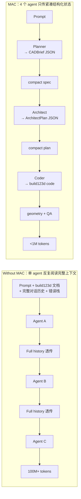
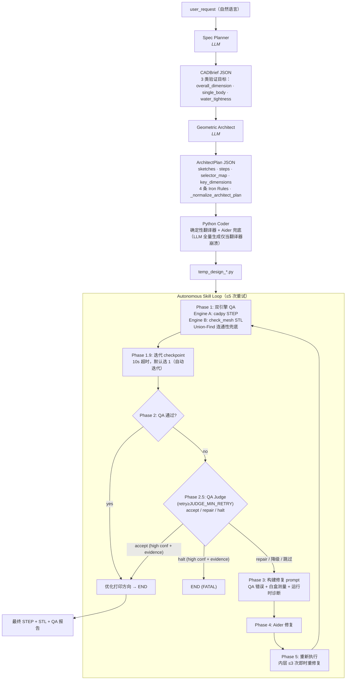

# Multi-Agent CAD System - 详细工作流文档

> Tsinghua University · IEI Lab

## 目录

1. [项目概述](#项目概述)
2. [系统架构](#系统架构)
3. [完整工作流](#完整工作流)
4. [节点详解](#节点详解)
5. [代码生成机制](#代码生成机制)
6. [QA 检测系统](#qa-检测系统)
7. [修复机制](#修复机制)
8. [关键特性](#关键特性)
9. [两种工作流](#两种工作流)
10. [与 CAD Skill 的对比](#与-cad-skill-的对比)

---

## 项目概述

本项目是一个基于 LangGraph 的多智能体 CAD 系统，能够将自然语言描述转换为精确的 STEP 格式 3D 模型。系统采用 **Autonomous Skill Loop** 架构，通过多个专业化智能体协作完成从需求分析到几何验证的完整流程。

### 核心特点

- **多智能体协作**: Spec Planner → Geometric Architect → Python Coder → Autonomous Skill Loop
- **双引擎 QA**: Engine A (STEP 拓扑分析) + Engine B (STL 网格分析)
- **混合代码生成**: 确定性翻译器 + Aider LLM 补充
- **自动修复循环**: Aider 根据 QA 反馈自动修复代码，最多 5 次重试
- **白盒插桩**: 在布尔合并前测量特征尺寸，供修复代理参考
- **build123d API 参考文件**: `build123d_reference.md` 自动注入 Aider 上下文，确保 API 用法正确
- **fillet 半径自动降级**: `_safe_fillet` 在 OpenCascade 拒绝大半径时自动尝试更小半径
- **语义边选择器**: `_infer_edge_filter` 返回基于 `e.length()` 的 list comprehension，避免 Aider 硬编码坐标

---

## 系统架构

### 核心思路：信息压缩，而非单纯多 agent

普通 multi-agent 流水线只是把任务拆给多个 agent，但每个 agent 仍然反复阅读完整对话历史 —— token 节省有限。MAC 的关键不是"有 4 个 agent"，而是 **agent 之间只传递紧凑的结构化状态**（`CADBrief` 几十字段、`ArchitectPlan` 几百字段），不传任何对话原文：



### 整体流程图



### LangGraph 状态流

```python
GraphState = {
    # 输入
    "user_request": str,              # 用户原始请求

    # 各节点输出
    "cad_brief": CADBrief,            # Spec Planner 输出
    "architect_plan": ArchitectPlan,  # Geometric Architect 输出
    "current_python_code": str,       # 当前代码
    "current_python_code_path": str,  # 代码文件路径 (Aider 编辑目标)
    "current_step_path": str,         # 当前 STEP 文件路径
    "current_stl_path": str,         # 当前 STL 文件路径

    # QA 与循环控制
    "qa_report": QAReport,            # QA 报告
    "judge_decision": JudgeDecision,  # QA Judge 输出 (Phase 2.5)，None 表示未调用或被跳过
    "error_type": ErrorType,          # 错误类型 (NONE/DIMENSION/TOPOLOGY/FATAL)
    "iteration_count": int,           # 当前迭代次数
    "max_iterations": int,            # 最大迭代次数 (通常 5)
    "force_refresh": bool,            # 强制刷新缓存

    # 工作流标识
    "workflow_id": str,               # "original" 或 "aider"
    "node_history": list[str],        # 节点执行历史
    "execution_log": list[str],       # 各节点日志
}
```

> **注意**: `previous_manifest`、`previous_dimensions_hash`、`stall_count`、`retry_mode`
> 等防停滞机制字段在 schemas.py 中保留为 TypedDict 定义，但在 nodes.py 中**未采用**
> (当前靠 `_MAX_SELF_RETRIES` 和 `MAX_RETRIES` 硬性重试上限兜底)。

---

## 完整工作流

### 阶段 1: 需求解析 (Spec Planner)

**输入**: 用户自然语言描述  
**输出**: `CADBrief` (Pydantic 模型)

**职责**:
- 解析用户请求，提取关键尺寸和约束
- 定义验证目标 (`verification_targets`)，**仅创建最终结果属性**：
  - OVERALL_DIMENSION (X, Y, Z) -- 最终包围盒
  - SINGLE_BODY -- 所有部件连接
  - WATER_TIGHTNESS -- 封闭流形
- 推断缺失参数（如默认公差、材料属性）
- 特征级尺寸（孔径、圆角、壁厚等）不由 QA 验证，由白盒插桩 + 修复代理负责

### 阶段 2: 几何设计 (Geometric Architect)

**输入**: `CADBrief`  
**输出**: `ArchitectPlan` (Pydantic 模型)

**职责**:
- 设计草图 (`sketches`)：定义 2D 轮廓
- 规划建模步骤 (`steps`)：拉伸、旋转、布尔运算、阵列等
- 生成选择器映射 (`selector_map`)：所有值设为 `"(skip)"`（QA 仅检测 3 类目标）
- 提取关键尺寸 (`key_dimensions`)

**Iron Rules (5 条)**:
1. **2D Sketch Local Coordinate System**: XZ/YZ 平面草图的本地 y 对应世界 Z
2. **Independent Sketches for Symmetric Features**: 对称特征用独立草图
3. **No Ghost Entities**: 所有坐标字段非 null
4. **Notes — 几何描述 OK，操作指令禁止**: notes 字段可含几何描述（"lug body 36x34 with semicircle top, R=18"），帮 Aider 选对 build123d API；但禁止操作指令（"mirror across XZ" / "extrude then rotate" / "use BuildLine"）——前者 Aider 可读、后者 Aider 忽略且确定性翻译器也无法解析。要镜像就用 `mirror` step、要拉伸就独立 sketch
5. **Custom Polygon Entities MUST Use control_points**: 非正多边形（lug/rib/cutout/custom profile）必须填 `control_points` 顶点列表，`num_sides` 和 `circumscribed_radius` 必须为 null。`num_sides + circumscribed_radius` 仅用于真正的正多边形（六角螺栓头、齿轮毛坯等）

**LLM step_type 预处理** (`_normalize_architect_plan`):
在 Pydantic 验证前自动修正 LLM 常见的命名错误：
- `pattern` → `pattern_circular`
- `union` → `boolean_union`
- `subtract` / `boolean_subtract` → `boolean_cut`
- `sweep` / `loft` → `extrude`

### 阶段 3: 代码生成 (Python Coder)

**输入**: `ArchitectPlan`  
**输出**: `temp_design_{iter}.py` (build123d Python 代码)

**三种生成模式**:

1. **确定性翻译器** (`_node_python_coder_deterministic`)
   - 直接将 ArchitectPlan 翻译为 build123d 代码
   - 支持的步骤类型：extrude, hole, boolean_union/cut, pattern_linear/circular, mirror, fillet, chamfer 等
   - 不支持的类型生成 `# TODO_AIDER` 占位符
   - Z 轴孔使用 `Align.MIN`（见下方"孔生成"说明）

2. **混合生成** (`_fill_unsupported_with_aider`)
   - 检测代码中的 `# TODO_AIDER` 占位符
   - 调用 Aider 仅填充不支持的部分（Aider 自动读取 `build123d_reference.md`）

3. **LLM 回退** (`node_python_coder` LLM 路径)
   - 如果确定性翻译器完全失败
   - 调用 LLM 直接生成完整代码

**孔生成 (Align.MIN)**:
build123d 的 `Cylinder` 默认居中对齐（中心在原点），`Pos(x,y,z)` 放置的是**中心**而非底部。
Z 轴通孔使用 `align=(Align.CENTER, Align.CENTER, Align.MIN)` 使 `Pos_z` 代表底部位置。

**生成的代码结构**:
```python
from build123d import *
import math, json

# 白盒插桩工具
_MEASUREMENTS = {}
def _measure_feature(solid, name, feature_type): ...
def _save_measurements(): ...  # 使用 ITERATION 环境变量

# 安全布尔运算
def _safe_cut(body, tool, label): ...
def _safe_fillet(solid, edge_selector_fn, radius, label): ...
def _safe_chamfer(solid, edge_selector_fn, length, label): ...

def gen_step():
    # --- 生成的几何体 ---
    # ... 各步骤 ...
    _measure_feature(final_solid, 'overall', 'final_assembly')
    # --- 写入运行时诊断（位置错误检测）---
    if _MISSED_CUTS:
        _iteration = int(_os.environ.get('ITERATION', '0'))
        with open(f'temp_missed_{_iteration}.json', 'w') as _f:
            json.dump(_MISSED_CUTS, _f)
    export_step(final_solid, "temp_output_0.step")
    export_stl(final_solid, "temp_output_0.stl", tolerance=0.01, angular_tolerance=0.1)
    _save_measurements()  # 写入 temp_measurements_{iter}.json
    return {"shape": final_solid}
```

### 阶段 4: 自主技能循环 (Autonomous Skill Loop)

**输入**: Coder 已生成的 STEP/STL + 代码路径 + CADBrief + ArchitectPlan  
**输出**: 最终 STEP 文件 + QA 报告

> **注意**: 循环的第一轮 QA 直接检测 Coder 产出的 STEP/STL，不先执行代码。
> 代码执行仅在 Aider 修复后发生。
> **Aider-First 工作流**: 如果初始生成失败（无 STEP/STL），跳过 QA 直接进入 Aider 修复。

**循环流程** (最多 5 次外层重试):

```
_skip_qa = False
_skip_initial_qa = (workflow_id == "aider" and no initial STEP/STL)

for retry in range(5):
    Phase 1: 双引擎 QA 检测 (Engine A + Engine B)
             Engine B 失败时 → fallback 连通性检查 (Union-Find, 不依赖 networkx)
             如果 _skip_qa 或 (_skip_initial_qa 且 retry==0) → 跳过 QA
    Phase 1.5: (仅 Aider 工作流) 几何验证门控（跳过当无初始 STEP/STL 时）
    Phase 1.8: 检查 temp_missed_{iter}.json 运行时诊断
    Phase 1.9: 用户迭代 checkpoint (10s 超时，默认选 1)
             首轮 (retry=0) 直接 choice=1，不弹 prompt —— 直接套用 user_request
             从 retry>=1 起：打印 STEP/STL 路径 + QA 状态
             选项 1: 自动迭代（10s 超时默认）
             选项 2: 用户介入（修改需求前置到 user_request，强制 fall through 到 Aider）
             选项 3: 停止（返回当前产物，ErrorType.NONE）
             非 TTY（CI / 管道输入）→ 自动选 1 不阻塞
    Phase 2: PASS 判定（带工作流门控）
             原始工作流：QA 通过 → 自动优化打印方向 → 返回成功
             Aider-First 工作流：retry=0 即使 QA 通过也不返回 ——
               user_request 是"修改需求"，基线几何 QA 通过 ≠ 修改已应用
               必须让 Aider 跑一轮，从 retry>=1 起才认 PASS
    Phase 2.5: QA Judge —— 模型自决终止迭代（详见 §节点详解 §关键特性）
             retry < JUDGE_MIN_RETRY (默认 1) → 跳过
             调用 node_judge_qa 评估 QA 报告：
               accept (high conf + evidence) → 返回 ErrorType.NONE
               halt   (high conf + evidence) → 返回 ErrorType.FATAL
               repair → 注入 context 到 error_details，走 Phase 3
               accept on FATAL/TOPOLOGY 但 confidence≠high 或 evidence 空 → 降级 repair
               LLM 调用失败 → None（safe default，走 Phase 3）
    Phase 3: 构建修复提示 (QA 错误 + 运行时诊断 + 特征测量)
             运行时诊断按类型分类: MISSED_CUT / FILLET_FAILED / CHAMFER_FAILED / CUT_ERROR
             如果连通性为 fatal → 抑制所有尺寸错误详情
             Aider-First retry=0 注入合成 "USER MODIFICATION REQUEST" 错误项，
               确保 Aider 优先应用修改需求而非死磕 QA 报告
    Phase 4+5: Aider 修复 → 重新执行（合并的内层循环）
             _run_repair_on_script (自动读取 build123d_reference.md)
             _execute_cad_script (设置 ITERATION env var)
             执行失败时即时重修复（最多 3 次，MAX_EXEC_RETRIES=3）
               每次重修复把 traceback 喂给 Aider，仅在循环内不消耗外层 retry 配额
             成功 → _skip_qa = False（下轮重新 QA）
             4 次全失败 → _skip_qa = True（下轮跳过 QA，直接 Aider）
```

**关键机制**:

- **`_skip_qa` 标志**：当 Aider 修复后执行仍然失败时，模型未变更。下一轮跳过 QA，直接进入 Aider 修复阶段
- **`_skip_initial_qa` 标志**：Aider-First 工作流初始生成失败时，首轮跳过 QA（无模型可检测）
- **`_prompt_iteration_choice` checkpoint**：Phase 1.9 在每轮 QA 后（首轮 retry=0 除外，首轮直接 choice=1）打印 STEP/STL 路径 + QA 状态，提供 10s 超时窗口让用户选自动迭代 / 介入 / 停止。介入时用户的修改需求会前置到 Aider 修复 prompt；非 TTY (CI / 管道输入) 自动选 1 不阻塞
- **路径重写**：`_execute_cad_script` 自动替换 export_step/export_stl 路径为当前迭代文件名
- **连通性 fatal 时抑制尺寸错误**：多体断开时所有尺寸测量不可靠，报告只保留拓扑错误
- **运行时诊断分类** (`_parse_missed_cuts` + `_format_missed_cuts_errors`)：将 `_MISSED_CUTS` 列表中的条目按前缀分类，生成针对性错误消息

---

## 节点详解

### 1. Spec Planner (`node_spec_planner`)

**职责**:
- 调用 LLM 解析用户需求
- 生成 `CADBrief`，仅包含 3 类验证目标（overall_dimension、single_body、water_tightness）
- 支持从缓存加载（避免重复调用）
- **不输出对称方向字段**——对称方向（X / Y / 镜像轴）由 Geometric Architect 从用户请求的空间语言（如 "one on each side"、"symmetric about XZ"）自行判断，Spec Planner 只负责需求解析

### 2. Geometric Architect (`node_geometric_architect`)

**职责**:
- 调用 LLM 设计几何方案
- 生成 `ArchitectPlan`，包含草图、步骤、选择器（全部 skip）
- 输出经 `_normalize_architect_plan` 预处理后通过 Pydantic 验证
- 支持拓扑重试和尺寸重试（70% 阻尼）
- 对称方向从用户请求空间语言（"one on each side" 等）自行判断——不依赖 `symmetry_plane` 这类显式字段，避免被规则约束后盲目 Y 翻转破坏 cutout 的 X 对称

### 3. Python Coder (`node_python_coder`)

**职责**:
- 确定性翻译器优先 → 混合 Aider → LLM 回退
- Z 轴孔使用 `Align.MIN`，Y/X 轴孔保持 CENTER
- 运行时诊断写入 `temp_missed_{iter}.json`（分类为 MISSED_CUT / FILLET_FAILED / CHAMFER_FAILED）

**确定性编码器关键改进**:

- **`_gen_sketch_algebra` polygon 分支**: polygon 实体按以下优先级处理：
  1. notes/label 含 non-regular 关键词（custom/wedge/sector/arc/semicircle/trapezoid 等） → 生成 `# TODO_AIDER`，control_points 作为参考数据塞进占位符
  2. `circumscribed_radius + num_sides` 存在 → 生成 `RegularPolygon(cr, ns)`（正多边形：六角螺栓头、齿轮毛坯）
  3. 仅 `control_points` 存在（无 non-regular 关键词） → 确定性生成 `BuildLine + Polyline + make_face`（简单闭合多边形：三角形、四边形等）
  4. fallback → 硬编码直角三角形（带 WARNING 提示 architect 应填 control_points）
  关键判断：control_points 配合 arc 关键词时走 TODO_AIDER（形状含圆弧，Polyline 画不出），control_points 单独存在时才走确定性 Polyline。

- **`_place_sketch`**: 直接使用 architect 的 `workplane_offset_mm`（sign-inverted for build123d），不再用 derived 的 `offset_from_center`（后者对 rib 等特征算错）。0.0 是有效 offset（不触发 fallback）。

- **`_infer_edge_filter`**: 返回 list comprehension（如 `[e for e in s.edges().filter_by(Axis.Z) if e.length() > 5]`），不再返回方法链。用 `e.length()` 过滤短 junction 边，避免 OpenCascade "ChFi3d_Builder: only 2 faces" 错误。

- **`_safe_fillet` / `_safe_chamfer`**: 接受 lambda 作为 edge selector，每次调用对当前 solid 重新求值 `.edges()`。半径自动降级（R → R/2 → R/4 → R/8），避免反复迭代失败。失败时输出边 bbox 诊断 + 修复建议。

### 4. Autonomous Skill Loop (`node_autonomous_skill_loop`)

**职责**:
- 双引擎 QA + fallback 连通性检查
- **Phase 2.5 QA Judge**（详见 §5）—— 模型自决终止迭代
- Aider 修复（自动读取 `build123d_reference.md`）+ 重新执行
- 内层执行重试（3 次即时重修复）

**几何验证门控** (`_validate_geometry_against_request`):
- Check 1: 包围盒合理性
- Check 2: 面数合理性（face_count 为 None 时跳过，不再误报）
- Check 3: 退化几何检测
- Check 4: fillet 体积异常检测—— 如果 user_request 提到 fillet/chamfer 但体积减少 < 0.5%，报 "Fillet volume anomaly"

### 5. QA Judge (`node_judge_qa`) — Phase 2.5

**职责**: 收到 QA 报告之后，模型自己评估报告是否合理，如不合理或不需要修改可选择自行结束迭代，避免被强制跑满 5 轮重试。

**何时介入**: `JUDGE_ENABLED=True` 且 `retry >= JUDGE_MIN_RETRY`（默认 1，可配置）。第一轮让 Aider 真正尝试一次，从第二轮起 Judge 才介入，避免无谓判断成本。

**三种决策**:

| 决策 | 含义 | 后果 |
|---|---|---|
| `accept` | QA 报告有误 / 设计意图已实质满足 / 持久内核限制 | 覆盖 QA 失败，返回 `ErrorType.NONE`，结束迭代 |
| `repair` | 真有问题，Aider 有合理机会修复 | 继续走 Aider 修复流程（safe default）|
| `halt` | 需求本身不可实现（自相矛盾 / 缺关键信息） | 停止迭代，返回 `ErrorType.FATAL` |

**Judge 看到的输入**（注意：**看不到 3D 网格、STEP 拓扑或可视化**）:
- `user_request` —— 原始自然语言设计意图（ground truth）
- `special_features` —— Spec Planner 提取的非平凡几何约束（对称性、多体意图、特征方位等）
- `feature_measurements` —— 白盒插桩数据（每个特征在 boolean 合并前的精确包围盒）
- `error_details` —— 双引擎 QA 的失败列表
- `retry_count` + `workflow_id`

**反幻觉 5 层防御**（Judge 只看结构化文本，在复杂拓扑冲突上容易"空间想象力幻觉"——生成听起来合理但物理错误的 ACCEPT 理由）:

1. **Prompt 层（主力）**: [prompts/qa_judge.md](prompts/qa_judge.md) 含 9 个 Few-Shot Examples（3 ACCEPT + 3 REPAIR + 1 HALT + 2 负例）+ Anti-Hallucination Iron Rule："如果你在测量数据中找不到支撑该拓扑冲突为合理设计的硬数据，请直接判定为 REPAIR，不要主观臆断"
2. **Schema 层**: `JudgeDecision.evidence: list[str]` 字段，ACCEPT/HALT 必须非空；`confidence: Literal["high", "medium"]` 直接拒绝 `"low"`
3. **Code 层**: Phase 2.5 evidence gate —— 空 evidence 在 ACCEPT/HALT 上自动降级为 REPAIR；FATAL/TOPOLOGY 上的 ACCEPT 还要求 `confidence="high"`
4. **Audit 层**: 每个 `JUDGE →` 决策（含 confidence、evidence 条数、reason 截断）写入 `execution_log`，落盘可审计
5. **Disable 层**: `JUDGE_ENABLED=False` 一键回退到改动前行为

> 没有任何单一层是可靠的——Prompt 做主力、Schema/Code 兜底、Audit 抓漏网、Disable 是应急按钮。

**Code-enforced gate（机械可验证）**:

| 决策 | 错误类型 | 要求 |
|---|---|---|
| ACCEPT | DIMENSION | 非空 `evidence`（任意 confidence）|
| ACCEPT | TOPOLOGY / FATAL | `confidence="high"` AND 非空 `evidence` |
| HALT | 任意 | `confidence="high"` AND 非空 `evidence` |
| REPAIR | 任意 | 无要求（安全默认）|

**Prompt-enforced constraint（依赖 LLM 合规，无法机械验证）**:
- DIMENSION ACCEPT 的 evidence 应引用 `is_mesh_noise=True` 或"偏差 < tolerance"的测量值
- TOPOLOGY/FATAL ACCEPT 的 evidence 应引用 `special_features` 中明确记录设计意图的条目
- HALT 的 evidence 应引用自相矛盾的 `key_parameters` 或缺失的关键信息

**配置**（[config.py](config.py) 新增 Stage 5 块）:

```python
JUDGE_ENABLED = True                # toggle the Judge agent on/off
JUDGE_MIN_RETRY = 1                # only invoke Judge after this many outer retries
JUDGE_MODEL = "qwen3.8-max"
JUDGE_TEMPERATURE = 0.0            # deterministic — judgment should be reproducible
JUDGE_MAX_TOKENS = 4096
JUDGE_KWARGS = {"extra_body": {"enable_thinking": True}}
```

改坏了用 `python -m multi_agent_cad._config_defaults --reset` 恢复默认。

### 5.1 视觉渲染（多模态输入）

**动机**: Judge 只看结构化文本时，在复杂拓扑冲突上容易"空间想象力幻觉"——生成听起来合理但物理错误的 ACCEPT 理由。给 Judge 喂实际渲染的模型多角度视图，让它用视觉 evidence 校准判断（例如 "view[1] 显示两个分离的齿轮，确认是设计意图的多体装配，QA 报告的 FATAL 连通性是误报"）。默认 `qwen3.8-max` 是多模态模型，直接走视觉路径；如果切到纯文本模型（如 `deepseek-chat`、`qwen3-coder` 等），auto 模式会自动检测 API 报错并跳过渲染步骤、回退到纯文本。

**配置**（[config.py](config.py) Stage 5b 块）：

```python
JUDGE_MULTIMODAL = "auto"           # "auto" | "always" | "never"
JUDGE_VIEWS_COUNT = 4               # 等轴测视图数（4 = 覆盖所有 8 卦限）
JUDGE_VIEW_SIZE = 512               # PNG 分辨率（方形）
JUDGE_SAVE_VIEWS = True             # 保存 PNG 到 temp_judge_views_{iter}/ 供审计
```

**三种模式行为**：

| 模式 | 渲染 | 消息格式 | API 失败处理 |
|---|---|---|---|
| `"never"` | 跳过 | 纯文本（`content: str`） | 直接 None → REPAIR |
| `"auto"`（默认） | 渲染 4 张 PNG | 多模态（`content: list[dict]`，1 text + 4 image_url） | 检测到 image/vision/multimodal/unsupported 错误 → 重试纯文本 |
| `"always"` | 渲染 4 张 PNG | 多模态 | 渲染失败/无 STL → None → REPAIR；API 失败不重试 → None → REPAIR |

**渲染流水线**（[render_views.py](render_views.py)）:

1. `trimesh.load(stl_path, force='mesh')` 加载 STL（复用 [_optimize_print_orientation:6828](nodes.py#L6828) 的模式）
2. 归一化：平移到 bbox 中心居中、缩放使 max-extent = 1，保证不同尺寸零件在视图中占满画面
3. matplotlib `Poly3DCollection` 渲染，**特征边过滤策略**：
   ```python
   # 1. 面：不画三角形剖分边（edgecolors='none'）——光滑平面不显示 STL 三角剖分线
   collection = Poly3DCollection(
       polygons,                       # verts[faces] → (F, 3, 3) 顶点坐标数组
       edgecolors='none',              # 跳过三角形剖分边，光滑表面保持光滑
       alpha=0.9,
       facecolors='#A0A0A0',           # 中性灰
   )
   ax.add_collection3d(collection)

   # 2. 特征边：相邻面夹角 > 10° 的真正棱线（孔缘、面交线、倒角过渡）
   angles = mesh.face_adjacency_angles              # (E,) 弧度
   edge_pair_indices = mesh.face_adjacency_edges    # (E, 2) 顶点索引
   feature_mask = angles > math.radians(10)
   feature_edges = mesh.vertices[edge_pair_indices[feature_mask]]  # (E', 2, 3)

   line_collection = Line3DCollection(
       feature_edges,
       colors='black',
       linewidths=0.8,                # 比之前 0.2px 更粗，因为现在数量少
   )
   ax.add_collection3d(line_collection)
   ```
   **特征边过滤是关键**——STL 的三角剖分会在光滑平面上产生几十~几百条"假边"，让多模态模型误判为表面纹理，并淹没真正的几何特征（孔缘、棱线、倒角过渡）。用相邻面夹角 > 10° 过滤后，只保留真正的几何特征边（典型零件约 33% 的邻接边是特征边），光滑平面保持光滑，特征轮廓突出可识别
4. 4 个等轴测视图角度（覆盖所有 8 卦限）：
   - view[0]: elev=+30, azim=+45（前左上）
   - view[1]: elev=+30, azim=+135（后右上）
   - view[2]: elev=-30, azim=+45（前右下）
   - view[3]: elev=-30, azim=+135（后左下）
5. base64 编码 + 包成 `data:image/png;base64,...` data URL，按 OpenAI 兼容 `image_url` 格式塞进 messages

**多模态 messages 构建**：

```python
content_list = [
    {"type": "text", "text": user_prompt},     # 文本在前，让 LLM 先读上下文
    {"type": "image_url", "image_url": {"url": "data:image/png;base64,..."}},
    {"type": "image_url", "image_url": {"url": "data:image/png;base64,..."}},
    {"type": "image_url", "image_url": {"url": "data:image/png;base64,..."}},
    {"type": "image_url", "image_url": {"url": "data:image/png;base64,..."}},
]
messages = [
    {"role": "system", "content": SYSTEM_PROMPT_QA_JUDGE},
    {"role": "user", "content": content_list},  # list 而非 str
]
```

OpenAI SDK 的 `chat.completions.create` 既接受 `content: str` 也接受 `content: list[dict]`，所以 `_call_llm_json_with_retry` 签名无需改动。

**Auto-fallback 错误检测**：`except Exception as exc`（catch-all，**不是** `(ValueError, json.JSONDecodeError, RuntimeError)`——后者漏抓 OpenAI SDK 的 `BadRequestError`，导致 auto-fallback 永远不触发）。API 报错字符串小写后包含 `image` / `vision` / `multimodal` / `unsupported` / `invalid content` / `does not support` / `not support` 任一关键词 → 判定为模型不支持 vision → 重试纯文本路径。覆盖 OpenAI / Anthropic / 阿里云 / DeepSeek 各家 provider 的报错措辞。

**Prompt 协同**：[prompts/qa_judge.md](prompts/qa_judge.md) §4 Visual Input section 告诉模型：
- 收到 image content blocks 时如何引用 `view[N]: <观察>` 作为 evidence
- 图像可能与 measurements 冲突时 trust measurements（matplotlib z-buffer 不完美）
- 没图像时按现有 Anti-Hallucination Iron Rule 走 REPAIR

**Token 成本**：每张 512×512 PNG ≈ 30-50KB base64；provider 通常按 1-2k token/张折算图像 token；4 张 ≈ 4-8k 额外输入 token/call。`JUDGE_MIN_RETRY=1` + `MAX_RETRIES=5` 下最坏 4 次多模态调用 = 16-32k 额外 token，仍 < MAC 总 896k 预算的 5%。

**Web UI 兼容性**: Judge 的 print（`[JUDGE] Rendered 4 views to temp_judge_views_1/`、`[JUDGE] Sending multimodal message: 1 text block + 4 image blocks`）通过 [web/server.py:304](web/server.py#L304) 的非 JSON stdout fallback 路径，作为 `{"log": line}` SSE 事件实时推送到浏览器日志区；保存的 PNG 在 `temp_judge_views_{iter}/view_{i}.png` 可通过现有 `/api/jobs/{id}/files/` 下载。但 `_config_schema()` 不暴露 `JUDGE_MULTIMODAL` 等字段——使用默认值，要调整必须改 [config.py](config.py)。

**LLM 调用失败**: safe default = REPAIR（fall through to Aider）。`_call_llm_json_with_retry` 已自带 3 次自纠错重试；最终失败 → `node_judge_qa` 返回 None → Phase 2.5 no-op → 走正常 Phase 3+ 流程。

**5 层反幻觉防御不变**：视觉 evidence 只是 `JudgeDecision.evidence: list[str]` 的另一种合法字符串格式（`view[N]: ...`），仍然走 Phase 2.5 的空 evidence → REPAIR 降级 gate。FATAL/TOPOLOGY 上的 ACCEPT 仍要求 `confidence="high"` + 非空 evidence。

### 5.2 用户参考图片（user_input_images/）

**动机**: 用户除了文字 prompt 之外，经常想直接给一张草图、参考零件的照片、或参考几何截图，让 pipeline "照着做"。Spec Planner 看图提取几何信息（形状、对称性、孔位等），Judge 看图与渲染图对比（"用户期望的 vs 当前生成的"）。

**用户输入**: 把图片放到 cwd 下 `user_input_images/` 文件夹（PNG/JPG/JPEG/WebP）。空文件夹 = 无图，pipeline 走纯文本路径。

**配置**（[config.py](config.py) Stage 0 块）:

```python
USER_IMAGES_DIR = "user_input_images"           # cwd 下文件夹名
USER_IMAGE_MAX_SIZE = 1024                       # 最大边长（保持纵横比，小图不放大）
USER_IMAGE_JPEG_QUALITY = 85                    # JPEG 重编码质量
SPEC_PLANNER_MULTIMODAL = "auto"                 # Spec Planner 多模态开关
```

`JUDGE_MULTIMODAL` 已在 §5.1 控制 Judge 端是否看用户图片。

**字母序确定性排序**：图片按文件名字母序（不区分大小写）加载，**不用 mtime**。原因：mtime 在跨平台 / Git 同步 / 网盘同步下不稳定——批量复制时 stamp 几乎相同的 mtime，读取顺序在每次运行间不可预测地"跳动"（Flapping）。Spec Planner 第一次把正视图认作 `user_image[0]`，第二次重跑却把侧视图认作 `user_image[0]`，会让 CADBrief 确定性漂移、引发幻觉。字母序锁定每个文件集的读取顺序——用户命名 `1.jpg`、`2.jpg` 即可控制顺序，每次运行绝对一致。

**图片预处理**（[image_preprocess.py](image_preprocess.py)）:

1. **双路径扫描**：先扫 cwd 下 `user_input_images/`（CLI 模式直接命中），如果空则 fallback 扫 `<repo_root>/user_input_images/`（Web UI 模式下 web_runner chdir 到 per-job tempdir 后仍能找到用户的图）。**CLI 和 Web UI 用户都用同一份图片文件夹**——无需额外配置
2. 扫描 `*.png/jpg/jpeg/webp`，按文件名字母序排序
3. PIL 加载，转 RGB（去 alpha / palette）
4. `max(width, height) > USER_IMAGE_MAX_SIZE` 时按比例缩放（小图不放大，避免浪费 token）
5. 重编码 JPEG quality=USER_IMAGE_JPEG_QUALITY（即使原是 PNG 也转 JPEG，统一压缩比避免大 PNG 涨 token）
5. base64 + `data:image/jpeg;base64,...` data URL

**职责分工**（关键架构决策）:

- **Spec Planner** 读用户图片 + 文字 prompt，把图片中的几何信息（形状、对称性、孔位）提取到 `key_parameters.user_image[N]: <描述>` —— 下游 Architect / Aider 通过 key_parameters 间接获取视觉意图，**不需要看图**
- **Judge** 同时读用户图片 + 自己渲染的 4 张等轴测视图，对比 `user_image[N]`（用户期望）vs `view[N]`（当前生成）。Judge 的 `reason` 字段把视觉对比结论传给 Aider（如 `"view[1] vs user_image[0]: lug 轮廓是三角形而非用户要求的半圆"`），Aider 据此修代码——**Aider 不直接看图**
- **Aider** 保持纯文本上下文，避免重构 `coder.run(prompt)` 接口 + 每轮重发图的高 token 成本

**消息构建**:

```python
# Spec Planner messages（多模态时）
content = [
    {"type": "text", "text": user_prompt},
    {"type": "image_url", "image_url": {"url": "data:image/jpeg;base64,..."}},  # user_image[0]
    {"type": "image_url", "image_url": {"url": "data:image/jpeg;base64,..."}},  # user_image[1]
    ...
]

# Judge messages（多模态时）
content = [
    {"type": "text", "text": user_prompt},
    {"type": "image_url", "image_url": {"url": "data:image/jpeg;base64,..."}},  # user_image[0]
    {"type": "image_url", "image_url": {"url": "data:image/jpeg;base64,..."}},  # user_image[1]
    {"type": "image_url", "image_url": {"url": "data:image/png;base64,..."}},   # view[0] rendered
    {"type": "image_url", "image_url": {"url": "data:image/png;base64,..."}},   # view[1] rendered
    {"type": "image_url", "image_url": {"url": "data:image/png;base64,..."}},   # view[2] rendered
    {"type": "image_url", "image_url": {"url": "data:image/png;base64,..."}},   # view[3] rendered
]
```

**多模态检测 + auto-fallback**: 与 §5.1 的 Judge 模式对称。`SPEC_PLANNER_MULTIMODAL` 取值：
- `"auto"`（默认）：尝试发图；API 报错含 `image`/`vision`/`multimodal`/`unsupported`/`invalid content`/`does not support` → 重试纯文本
- `"always"`：必须有图；加载失败 → Spec Planner 返回 FATAL
- `"never"`：跳过扫描，强制纯文本

**默认 `qwen3.8-max` 支持多模态**（vision + text）——auto 模式下直接走多模态路径，Spec Planner 读 `user_input_images/` 提取几何信息，Judge 同时对比用户原图和渲染视图。如果切到纯文本模型（如 `deepseek-chat`、`qwen3-coder` 等），auto 模式会检测到 API 报错含 `image`/`vision`/`multimodal`/`unsupported`/`does not support`/`not support`/`invalid content` 关键词 → 自动重试纯文本路径，图片被丢弃但 pipeline 仍能完成。

**背景杂物处理**: 用户照片可能含桌面、手、其他物体。**不做背景去除**（flood-fill / 分割算法风险高，易损物体边缘）。靠 prompt 提示——[spec_planner.md §6](prompts/spec_planner.md) 和 [qa_judge.md §4.1](prompts/qa_judge.md) 都明确告诉模型 "用户图片可能含背景杂物，关注主要物体几何形状，忽略背景"。用户要干净图片自己裁好再放文件夹。

**Spec Planner 缓存交互**：现有 `pipeline_cache/cad_brief.json` 缓存机制（[nodes.py:7426](nodes.py#L7426)）跳过 Spec Planner 如果命中缓存。用户改图但保留文本 prompt 时，缓存命中导致图片不重读。要换图重跑必须清缓存：`rm pipeline_cache/cad_brief.json`，或设 `force_refresh=True`。

**Web UI 兼容性**: v1 不暴露 `user_input_images/` 上传字段。用户手动把图放到服务端文件夹；Judge / Spec Planner 的 print（`[SPEC PLANNER] Loaded 2 user images`、`[JUDGE] Loaded 2 user reference images`）通过现有 SSE 路径实时流到浏览器日志区。Web UI 上传字段 + per-job tempdir 持图待 v2。

**Token 成本**: 每张 JPEG ~50-150KB（1024×1024 max + q=85），provider 通常按 1-2k token/张折算。Judge 2-3 张用户图 + 4 张渲染视图 ≈ 6-14k 额外输入 token/call；Spec Planner 2-3 张用户图 ≈ 2-6k 额外输入 token/call。最坏 4 次 Judge 调用 + 1 次 Spec Planner = ~30-60k 额外 token，仍 < MAC 总 896k 预算的 7%。

**HEIC 不支持**: stock PIL 不支持 iPhone HEIC 格式，需要 `pillow-heif` 插件。用户要 HEIC 自己转 JPG。

---

## 代码生成机制

### 确定性翻译器 (`_plan_to_code`)

**支持的步骤类型**:

| 步骤类型 | 说明 | 生成的代码示例 |
|---------|------|---------------|
| `extrude` | 拉伸 | `solid_0 = extrude(sk_profile, amount=22.0)` |
| `extrude_cut` / `cut` | 减性拉伸 | 拉伸草图后 `_safe_cut` |
| `revolve` | 旋转 | `solid_0 = revolve(sk, revolution_arc=360, axis=Axis.Z)` |
| `hole` | 孔 (含沉头孔) | Z 轴: `Pos(x,y,z) * Cylinder(r, h, align=MIN)` + `_safe_cut` |
| `simple_hole` / `counterbore_hole` | 孔别名 | 同 `hole` |
| `boolean_union` | 布尔并 | `solid_1 = solid_0 + solid_1` (含自适应重叠) |
| `boolean_cut` | 布尔减 | `solid_1 = _safe_cut(solid_0, tool_0, 'step-id')` |
| `boolean_intersect` | 布尔交 | `solid_1 = solid_0 & solid_1` |
| `pattern_linear` | 线性阵列 | `for _i in range(count): ...` |
| `pattern_circular` | 圆形阵列 | `for _i in range(count): _rotated = Rot(Z=angle) * feature` |
| `mirror` | 镜像 | `solid_1 = mirror(solid_0, about=Plane.XZ)` + union |
| `fillet` | 圆角 | `solid_0 = _safe_fillet(solid_0, lambda s: [e for e in s.edges()...], radius=r)` |
| `chamfer` | 倒角 | `solid_0 = _safe_chamfer(solid_0, lambda s: ..., length=l)` |
| `shell` | 抽壳 | `shell(solid, thickness=t)` |
| `sketch_2d` | 独立草图 | 仅定义草图，不生成实体 |
| `reference` | 参考几何 | 传递引用，不生成新实体 |
| `draft` / `rib` | 拔模/加强筋 | 生成 `# TODO_AIDER` 占位符 |

### 草图生成 (`_gen_sketch_algebra`)

**polygon 实体处理优先级**:

1. **notes/label 含 non-regular 关键词**（custom/wedge/sector/arc/semicircle/trapezoid 等） → 生成 `# TODO_AIDER`，`control_points` 作为顶点参考数据塞进占位符
2. **`circumscribed_radius + num_sides` 存在** → 生成 `RegularPolygon(cr, ns)`（正多边形：六角螺栓头、齿轮毛坯）
3. **仅 `control_points` 存在**（无 non-regular 关键词） → 确定性生成 `BuildLine + Polyline + make_face`（简单闭合多边形：三角形、四边形等，绕过 Aider）
4. **fallback** → 硬编码直角三角形（带 WARNING 提示 architect 应填 control_points）

> **关键判断**：`control_points` + arc 关键词 → 走 TODO_AIDER（形状含圆弧，Polyline 画不出）；`control_points` 单独存在 → 才走确定性 Polyline。

**None 值防御**: `get` 函数处理 Pydantic 字段为 None 的情况，回退到默认值。

### 混合生成 (`_fill_unsupported_with_aider`)

Aider 自动读取 `build123d_reference.md`（通过 `fnames` 参数注入），确保填充的代码使用正确的 build123d API。

---

## QA 检测系统

### 职责分离

**QA 仅验证 3 类最终结果属性**：
1. OVERALL_DIMENSION (X, Y, Z) -- 最终包围盒
2. SINGLE_BODY -- 所有部件连接
3. WATER_TIGHTNESS -- 封闭流形

**白盒数据不参与 QA 检测**，仅在修复提示中供 Aider 代理参考。

### 双引擎架构

#### Engine A: cadpy STEP 拓扑分析

**测量优先级**:
1. **PRIORITY 0: 选择器匹配** (`_resolve_selector`) — 解析 selector DSL 表达式
2. **PRIORITY 1: 白盒插桩** — 从 `temp_measurements_{iter}.json` 读取
3. **PRIORITY 2: STEP 拓扑分析** — 特征关键词守卫保护

**特征关键词守卫** (两引擎统一):
```python
{"lug", "rib", "cutout", "boss", "flange", "tab", "gusset", "ear", "arm",
 "leg", "web", "slot", "fin", "hub", "blade", "backplate", "shaft",
 "housing", "bracket", "plate", "cover", "base", "cap", "tread"}
```

#### Engine B: check_mesh.py STL 网格分析

**分析内容**:
- 整体尺寸、孔径检测、壁厚测量、结构分析
- **拓扑连通性** (致命检查)：使用 Union-Find 算法检测分离实体（不依赖 networkx）
- 可制造性评估

**连通性检查 (`_check_connectivity`)**:
- 使用 Union-Find 在面邻接图上检测连通分量
- 按表面积比例估算各分量体积
- 过滤微小碎块（< 总体积 0.1%）
- ≥2 个显著分量 → `is_fatal=True` → TOPOLOGY 路由

**fallback 连通性检查** (`_fallback_connectivity_check`):
当 check_mesh.py 超时或崩溃时，nodes.py 内部使用独立的 Union-Find 实现进行兜底检测。

**Engine B 错误处理**:
所有 4 个错误路径（超时、异常、非零退出码、JSON 解析失败）都会调用 fallback 连通性检查，将结果注入 `raw_json["connectivity"]`。

**body_count=None 语义**:
当 check_mesh.py 自身失败时，合成连通性报告用 `body_count=None`（不再是 99 哨兵）。`single_body` VerificationResult 的 `measured_value` 在 None 时也返回 None，不再误报 99.0。

### 报告合并 (`_merge_engine_reports`)

**路由规则**（按优先级）:
- **RULE 0**: 双引擎故障 → `FATAL`；单引擎故障 → `DIMENSION`
- **RULE 1**: 拓扑连通性失败 → `TOPOLOGY`
- **RULE 2**: 非水密 → `TOPOLOGY`
- **RULE 3**: 真实尺寸失败 → `DIMENSION`（连通性 fatal 时抑制详情）
- **RULE 4**: 强度评分 < 40 或严重悬垂 → `TOPOLOGY`
- **RULE 5**: 严重悬臂杠杆 → `TOPOLOGY`

---

## 修复机制

### Aider 修复流程

**双路径设计**:
- **主路径 (Aider)**: 使用 `aider.coders.Coder` + `qwen3.8-max`，`fnames` 包含脚本路径 + `build123d_reference.md`
- **回退路径 (Direct API)**: 当 Aider 不可用时，直接调用 DashScope API。系统 prompt (`_SYSTEM_PROMPT_REPAIR`) 包含与 `build123d_reference.md` 等价的内容。

**build123d API 参考文件**:
`build123d_reference.md` 通过 Aider 的 `fnames` 参数注入上下文，覆盖：
- Cylinder/Box 对齐行为（Align.MIN 用于 Z 轴通孔）
- Pos/Rot 变换顺序
- extrude API（`dir` 而非 `direction`）
- 布尔运算（`_safe_cut` 而非 `body - tool`）
- 倒角/斜面（必须在布尔运算之后）
- Mirror for Symmetric Parts（对称特征用 mirror 而非重画）
- Rib Perpendicularity（筋板草图平面必须正交于连接面）
- 常见错误速查表

### 修复提示结构 (`_build_autonomous_repair_prompt`)

1. 用户原始需求（ground truth）
2. 白盒特征测量数据
3. **Judge 已决策 REPAIR — 执行而非重新判断**（Judge 接管"用户意图 vs QA 冲突"判断后，Aider 不再重复）
4. **信息优先级**（5 级，Judge 接管后新增第 1 级）：
   - Judge 的 reason + evidence（前置在 error_details 里，前缀 `JUDGE context (proceeding to repair): ...`）
   - QA 报告（overall bounding box, connectivity, watertightness）
   - 白盒数据（特征级尺寸）
   - 用户定量数据
5. QA 错误报告（含 Judge 的 reason + evidence 前置）
6. 九条铁律

**Judge 决策注入 Aider 的机制**：
- Judge 选 REPAIR 时，其 `reason` + `evidence` 通过 [nodes.py Phase 2.5](nodes.py) 注入 `last_qa_report.error_details` 的最前面，格式为 `JUDGE context (proceeding to repair): <reason> | Evidence: <evidence...>`
- Aider 在修复 prompt 里看到这段，知道 Judge 已判断 + 优先级 + 修复方向
- **防御性修正前缀**：如果 Judge 的 reason 以 `DEFENSIVE CORRECTION:` 开头，表示这是物理合理性修正（如加 overlap、加圆角、增加壁厚），保留用户意图但确保物理可行——Aider 应当作"防御性覆盖"执行。这是之前单 agent 隐式防御性修正的显式化、可审计化版本
- **三种决策对应三种 Aider 行为**：
  - ACCEPT → Aider 不被调用（Judge 已确认当前模型可用）
  - REPAIR → Aider 按 Judge 的 reason + error_type 修代码
  - HALT → Aider 不被调用（Judge 已确认需求不可实现）

**铁律**:
1. **特征保护**: 禁止删除特征来逃避检查
2. **坐标系与变换顺序**: 必须"先拉伸，后定位"
3. **100% 代数 API**: 详见 `build123d_reference.md`
4. **严禁上下文管理器**: BuildLine 除外
5. **保持原始需求**: 所有特征必须保留
6. **穿透切割**: Z 轴孔必须用 `Align.MIN`
7. **倒角最后**: fillet/chamfer 在所有布尔运算之后
8. **`_measure_feature` 记录调用时刻的变量状态**
9. **筋板草图平面必须正交于连接面**: 筋板草图平面和连接面平面正交、不能相同

---

## 关键特性

### 1. 白盒插桩 (`_measure_feature`)

- 在布尔合并前测量每个特征的精确尺寸
- 保存到 `temp_measurements_{iter}.json`（通过 ITERATION 环境变量命名）
- QA 引擎不使用白盒数据，仅传递给修复代理

### 2. 连通性检查 (Union-Find)

check_mesh.py 的 `_check_connectivity` 和 nodes.py 的 `_fallback_connectivity_check` 均使用 Union-Find 算法，**不依赖 networkx**。

### 3. Architect Plan 预处理 (`_normalize_architect_plan`)

在 Pydantic 验证前自动修正 LLM 常见的 step_type 命名错误。

### 4. fillet 半径自动降级 (`_safe_fillet`)

- 尝试 R → R/2 → R/4 → R/8 四档半径
- 任一档成功就返回；记 `FILLET_DEGRADED` 到 `_MISSED_CUTS`
- 全部失败时输出边 bbox 诊断 + 修复建议
- 用 lambda 强制每次重新求值 `.edges()`，防止 stale-edges 覆盖 bug

### 5. 语义边选择器 (`_infer_edge_filter`)

返回 list comprehension（如 `[e for e in s.edges().filter_by(Plane.XY) if e.length() > 30]`），用 `e.length()` 过滤短 junction 边。不依赖硬编码坐标，泛化到不同尺寸的零件。

### 6. control_points 确定性生成 (`_gen_sketch_algebra`)

polygon 实体仅 `control_points` 存在（且 notes 无 arc/custom 关键词）时直接生成 `BuildLine + Polyline + make_face`，绕过 Aider。形状含圆弧（notes 含 custom/semicircle/wedge 等）时仍走 TODO_AIDER 让 Aider 用 ThreePointArc 处理。

### 7. Architect Offset 的无损传递 (`_place_sketch`)

直接用 architect 的 `workplane_offset_mm`（sign-inverted），不用 derived 的 `offset_from_center`。0.0 是有效值（特征在中心），不触发 fallback。

### 8. QA Judge —— 模型自决终止迭代 (`node_judge_qa`)

**动机**: 没有 Judge 之前，`node_autonomous_skill_loop` 的 PASS 判定完全由 QA 的 `all_passed` 决定，QA 报告失败就强制跑满 5 轮 Aider 修复——把重试预算浪费在 QA 误报、设计意图已满足但差一丝精度、物理不可实现（如 P8 叶轮圆角冲突）或多体装配被误判 FATAL 上。

**设计**: 在 Phase 2（PASS 判定）和 Phase 3（构建修复 prompt）之间插入 Phase 2.5，调用独立的 Judge LLM 评估报告合理性，可输出 `accept` / `repair` / `halt`。详见 §节点详解 §5。

**反幻觉核心**: Judge 看不到 3D 网格，只能从 `feature_measurements` + `error_details` + `special_features` + `user_request` 推断。在复杂拓扑冲突上容易"空间想象力幻觉"——5 层防御（prompt 9 个 Few-Shot Examples + schema evidence 字段 + code evidence gate + audit log + disable 开关）缺一不可。

**关键收益**:
- P8 叶轮圆角冲突这类持久内核限制 → Judge 在 4 次失败后 ACCEPT，把唯一 benchmark 失败转成有理有据的 ACCEPT
- P9 螺旋楼梯防御性修正 → Judge 选 **REPAIR + `DEFENSIVE CORRECTION:` 前缀**，把"加 overlap 避免断裂"的物理合理性修正指令传给 Aider（之前单 agent 隐式做的，现在显式可审计）
- 多体装配被误判 FATAL → `special_features` 已记录意图，Judge 直接 ACCEPT，省下 5 轮徒劳修复
- 需求自相矛盾（如 Ø80mm bore in 60mm-wide block）→ Judge 直接 HALT，不浪费 Aider 5 轮修复预算

**三种决策 + 防御性修正机制**（Judge 三决策对应三种场景）：

| 场景 | 决策 | 例 |
|---|---|---|
| 需求自相矛盾（数学不可实现）| HALT | Ø80mm bore in 60mm block（数学上切断块体）|
| 物理常识不足（数学可修）| REPAIR + `DEFENSIVE CORRECTION:` 前缀 | P9 踏步加 overlap、薄壁加圆角 |
| QA 误报（设计意图已实质满足）| ACCEPT | 多体装配被误判 FATAL（带 special_features 证据）|

**默认配置**: `JUDGE_ENABLED=True`、`JUDGE_MIN_RETRY=1`、`JUDGE_MODEL=qwen3.8-max`（thinking 启用，多模态：支持文本 + 图像输入）。要关掉设 `JUDGE_ENABLED=False`。

---

## 两种工作流

系统提供两个独立的入口脚本，对应两种不同的工作流。原始工作流走完整 4 阶段流水线（Spec Planner → Geometric Architect → Python Coder → Autonomous Skill Loop）；Aider-First 工作流**跳过前 3 个阶段**，直接加载已有 .py 文件并进入 Autonomous Skill Loop。

### 1. 原始工作流（`graph.py`，`workflow_id = "original"`）

```bash
python -m multi_agent_cad.graph
```

**适用场景**：有明确需求和尺寸的从零生成（用户能给出具体尺寸、对称轴、孔位、圆角半径等约束）

**架构**：完整 4 阶段流水线

```
Spec Planner → Geometric Architect → Python Coder → Autonomous Skill Loop
(LLM)         (LLM)                 (确定性翻译器    (QA + Aider 修复)
                                       优先 + LLM 兜底)
```

**特点**：
- Python Coder 阶段优先用确定性翻译器 [`_plan_to_code`](nodes.py) 直接从 `ArchitectPlan` 翻译成 build123d 代码，**零 token 成本**
- 只有不支持的 step type（`draft`、`rib`、无 `control_points` 的自定义多边形）才生成 `# TODO_AIDER` 占位符由 Aider 填充
- Aider 在 Autonomous Skill Loop 中作为"修复"角色出现，不作为初始生成器
- 适合"标准零件 + 自定义 sketch"的场景

### 2. Aider-First 工作流（`graph_aider.py`，`workflow_id = "aider"`）

```bash
python -m multi_agent_cad.graph_aider
```

**适用场景**：对已有模型做修改，或凭印象（无明确尺寸、只有大致概念）让 Aider 自主迭代生成

**架构**：仅 2 个节点，**跳过 Spec Planner / Geometric Architect / Python Coder**

```
existing_file_loader → Autonomous Skill Loop
(加载 + 执行已有 .py)   (QA + Aider 修复)
```

**关键差异**：
- **不经过 Spec Planner / Geometric Architect / Python Coder** —— 没有 `CADBrief` 和 `ArchitectPlan` 中间产物，整个前 3 阶段被跳过
- `existing_file_loader` 节点自动发现 cwd 下最新的 `temp_design*.py`（或通过 `state["current_python_code_path"]` 显式指定），读取后用 `subprocess.run` 执行一次，得到初始 STEP/STL
- `USER_REQUEST` 被当作 **MODIFICATION REQUIREMENTS**（修改需求）处理，不是从零的规格说明 —— 直接喂给 Aider 作为修改指令
- Aider 直接读取已有的 `temp_design*.py`，按 `USER_REQUEST` 的语义**修改**（而非重写）现有代码
- 如果已有 .py 执行成功产出 STEP/STL → Phase 1 正常跑 QA → 即便 QA 通过也**不返回成功**（Phase 2 被 `retry > 0 or workflow_id != "aider"` 门控拦截），强制走一轮 Aider 把修改需求应用到模型上；从 retry>=1 起才认 PASS
- 如果已有 .py 执行失败（无 STEP/STL 产出） → `_skip_initial_qa = True`，首轮跳过 QA 直接进入 Aider 修复
- 若 cwd 下无任何 `temp_design*.py` → `existing_file_loader` 返回 `FATAL`，需先跑 `graph.py` 生成基础文件或显式指定 `current_python_code_path`

### 工作流选择建议

| 场景 | 推荐 |
|---|---|
| 有明确尺寸 + 从零生成 | `graph.py` (original) |
| 凭印象 / 模糊概念生成 | `graph_aider.py` (aider)（需先准备 skeleton .py） |
| 修改 / 迭代已有 `temp_design.py` | `graph_aider.py` (aider) |
| 含 `draft` / `rib` / 复杂变换 | 先 `graph.py` 生成基础，再 `graph_aider.py` 改 |
| 已有外部 .py 想用 Aider 改 | `graph_aider.py` (aider)（设 `current_python_code_path`） |

### `workflow_id` 字段

`GraphState` 的 `workflow_id` 字段标识当前工作流：
- `"original"` → `graph.py` 入口，确定性翻译器优先
- `"aider"` → `graph_aider.py` 入口，Aider 优先

各阶段根据 `workflow_id` 选择不同的分支逻辑（详见 §完整工作流 §阶段 4 中 Phase 1.5 / `_skip_initial_qa` 的条件判断）。

---

## 与 CAD Skill 的对比

本项目 (`multi_agent_cad`) 与同一仓库中的 CAD Skill 都实现了从自然语言到 STEP 模型的生成流程，但架构理念截然不同。

### 架构对比

```
CAD Skill (单 Agent):
┌──────────────────────────────────────────────────────────┐
│  单一 LLM Agent (Claude/GPT)                              │
│  ┌─────────┐  ┌─────────┐  ┌──────────┐  ┌───────────┐   │
│  │CAD Brief│→ │写源代码  │→ │ scripts/ │→ │ inspect   │   │
│  │(散文笔记)│  │(python) │  │step 执行  │  │CLI 验证   │   │
│  └─────────┘  └─────────┘  └──────────┘  └───────────┘   │
│      ↑                                            ↓      │
│      └──── 修复循环 (同一个 Agent 读错误、改代码) ────┘      │
└──────────────────────────────────────────────────────────┘

Multi-Agent CAD (多 Agent 流水线):
┌────────┐   ┌──────────┐   ┌────────┐   ┌───────────────────┐
│Spec    │ → │Geometric │ → │Python  │ → │Autonomous Skill   │
│Planner │   │ Architect│   │Coder   │   │Loop (QA + 修复)    │
│(LLM)   │   │(LLM)     │   │确定性+LLM│  │(双引擎QA + Aider)  │
└────────┘   └──────────┘   └────────┘   └───────────────────┘
     ↓             ↓              ↓               ↓
 CADBrief    ArchitectPlan   temp_design.py   QA Report + STEP
 (JSON)      (JSON)          (Python)         (JSON + STEP)
```

### 核心维度对比

| 维度 | CAD Skill | Multi-Agent CAD |
|------|-----------|-----------------|
| **Agent 数量** | 1 个 | 4 个 + Aider 修复 |
| **工作流控制** | Prompt 引导 | LangGraph 状态机 |
| **中间产物** | 散文笔记 | 结构化 JSON |
| **代码生成** | LLM 直接编写 | 确定性翻译器为主 |
| **QA 方式** | CLI 工具 + 快照 | 双引擎自动 QA |
| **修复机制** | 同一 Agent 改代码 | Aider 定向修复 |
| **fillet 处理** | LLM 自行处理 | `_safe_fillet` 半径降级 + lambda |
| **边选择器** | LLM 自行决定 | `_infer_edge_filter` 语义选择器 |
| **装配支持** | ✅ | ❌ 仅单零件 |
| **视觉审查** | ✅ 强制快照 | ❌ 纯几何分析 |

---

## 总结

本项目实现了一个完整的多智能体 CAD 系统。系统采用 **Autonomous Skill Loop** 架构，通过确定性代码生成 + Aider LLM 补充 + 双引擎 QA 检测 + 自动修复循环，实现了高成功率的几何生成和验证。

**核心优势**:
- **token 消耗量大幅减小**: 仅为原skill的 1%
- **多智能体协作**: 专业化分工
- **混合代码生成**: 确定性 + LLM
- **双引擎 QA**: STEP 拓扑 + STL 网格
- **自动修复**: Aider + 半径降级
- **白盒插桩**: 精确中间数据
- **API 参考文件**: 确保 Aider 使用正确 API
- **语义边选择器**: 泛化到不同尺寸零件
- **control_points 确定性**: 简单多边形绕过 Aider 直接生成 Polyline

---

## 附录

### A. 文件结构

```
Multi-Agent-CAD/
├── multi_agent_cad/              # 项目核心
│   ├── nodes.py                  # 所有节点实现
│   ├── schemas.py                # Pydantic 数据模型
│   ├── graph.py                  # LangGraph 工作流定义
│   ├── graph_aider.py            # Aider-first 工作流
│   ├── build123d_reference.md    # build123d API 参考（注入 Aider 上下文）
│   ├── token_tracker.py          # token 消费追踪
│   ├── WORKFLOW.md                # 本文档
│   └── __init__.py
├── legacy_refs/
│   └── check_mesh.py             # STL 网格分析（Union-Find 连通性）
├── packages/
│   └── cadpy/                    # STEP 拓扑分析（Engine A 依赖）
├── pipeline_cache/
│   ├── cad_brief.json            # Spec Planner 缓存
│   └── architect_plan.json       # Geometric Architect 缓存
├── .venv/ .venv_311/             # Python 环境
├── environment.yml               # conda 环境定义
├── temp_*.py                     # 生成的代码文件
├── temp_output_*.step/stl        # 生成的 STEP/STL 文件
├── temp_measurements_*.json      # 白盒测量数据
└── temp_missed_*.json            # 运行时诊断
```

仓库只保留 `multi_agent_cad/` 核心代码 + `legacy_refs/check_mesh.py` + `packages/cadpy`（vendored runtime）。`packages/cadpy` 不是 pip 依赖——`nodes.py` 在运行时用 `sys.path.insert(0, _REPO_ROOT / "packages" / "cadpy" / "src")` 注入路径后 `from cadpy.generation import ...`，无需 `pip install -e packages/cadpy`。cadpy 自身的依赖（`build123d` / `cadquery-ocp`）由根 `pyproject.toml` + `build123d` 的 transitive 拉到。仓库不包含 skills/plugins/viewer/docs/benchmarks/scripts/tests 等 skill 仓库基础设施。

### B. 环境变量

- `DASHSCOPE_API_KEY`: Qwen API 密钥
- `ITERATION`: 当前迭代号（由 `_execute_cad_script` 设置）

### C. 依赖项

```
langgraph>=0.2,<0.3
langgraph-checkpoint>=2.0,<3.0
build123d>=0.8               # CAD 建模引擎；transitive 拉到 cadquery-ocp-novtk（提供 `OCP`）
pydantic>=2.5
aider-chat>=0.50            # Aider 代码修复 (手动装: pip install --no-deps aider-chat==0.82.3, 绕开 numpy==1.26.4 pin)
openai>=1.20.0              # DashScope API (Qwen，OpenAI 兼容端点)
anthropic>=0.30             # Claude fallback (optional)
numpy>=1.24,<2.3
trimesh>=4.0                # STL 网格分析 (Engine B)
rtree>=1.1                 # trimesh 配套
scipy>=1.10                 # 孔洞聚类检测（check_mesh.py 用 scipy.spatial.cKDTree）
scikit-learn>=1.3
```

> **cadpy 不在此列表中**：`packages/cadpy` 是 vendored runtime，由 `nodes.py` 在运行时通过 `sys.path.insert` 加载 `packages/cadpy/src`，无需 pip 安装。详见 §附录 A。

> **`OCP` 不在此列表中**：`OCP` 是 import 名（`from OCP import ...`），不是 PyPI 包名。可安装的包是 `cadquery-ocp`（含 vtk）或 `cadquery-ocp-novtk`（不含 vtk），由 `build123d` 的依赖关系传递性拉入。

> **注意**: `networkx` 不是必需依赖。连通性检查使用 Union-Find 算法。

### D. 参考资料

- [LangGraph 文档](https://langchain-ai.github.io/langgraph/)
- [build123d 文档](https://build123d.readthedocs.io/)
- [Aider 文档](https://aider.chat/)
- [earthtojake/text-to-cad](https://github.com/earthtojake/text-to-cad)（CAD Skills）

---

**最后更新**: 2026.7.28
**实验室**: Tsinghua University, IEI Lab
